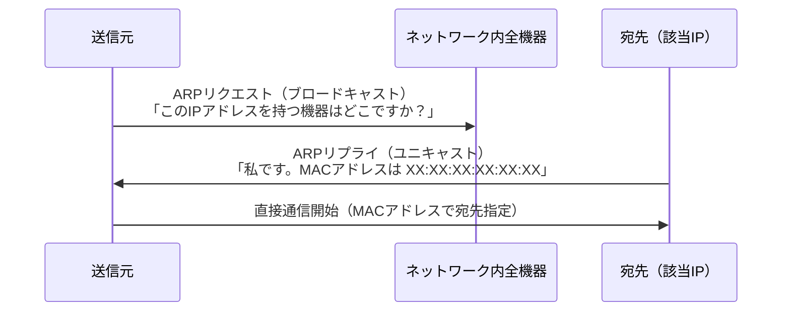

# ARP（Address Resolution Protocol）

## 概要
IPアドレスしか分からない相手からMACアドレスを取得するためのプロトコル。

## 理解したこと

### 動作の流れ

### なぜMACアドレスが必要か（IPアドレスだけでは不十分な理由）
- **プライベートIPアドレスの重複**：プライベートIPアドレスは異なるネットワーク間で重複が許容されるため、IPアドレスだけではグローバルに一意な端末特定ができない
- **L2機器の制約**：スイッチ・ハブはデータリンク層（L2）までしか対応しておらず、MACアドレスを基に動作する。MACアドレスがなければL2機器が機能しない

### MACアドレスの存在意義
- ① 世界規模でデバイスを一意に識別する身分証（本人確認）
- ② IPアドレスへの橋渡し（ARPによる変換）

## 関連概念
- mac_address.md
- ip_address.md
- network_identifiers.md
- network_communication_types.md
- hub_and_switch.md

## ソース
- 2026-04-10・書籍「イラスト図解式ネットワークの基本」第3章

## タグ
ネットワーク, ARP, MACアドレス, IPアドレス, データリンク層, アドレス解決
