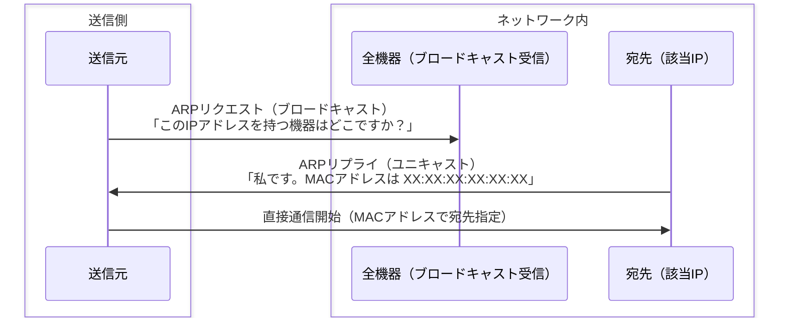

# ARP（Address Resolution Protocol）

## 概要
IPアドレスしか分からない相手からMACアドレスを取得するためのプロトコル。

## 理解したこと

### 動作の流れ

```mermaid
sequenceDiagram
    box 送信側
    participant A as 送信元
    end
    box ネットワーク内
    participant ALL as 全機器（ブロードキャスト受信）
    participant B as 宛先（該当IP）
    end

    A->>ALL: ARPリクエスト（ブロードキャスト）<br/>「このIPアドレスを持つ機器はどこですか？」
    B->>A: ARPリプライ（ユニキャスト）<br/>「私です。MACアドレスは XX:XX:XX:XX:XX:XX」
    A->>B: 直接通信開始（MACアドレスで宛先指定）
```

---

### なぜMACアドレスが必要か（IPアドレスだけでは不十分な理由）

- **プライベートIPアドレスの重複**：プライベートIPアドレスは異なるネットワーク間で重複が許容されるため、IPアドレスだけではグローバルに一意な端末特定ができない
- **L2機器の制約**：スイッチ・ハブはデータリンク層（L2）までしか対応しておらず、MACアドレスを基に動作する。MACアドレスがなければL2機器が機能しない

---

### MACアドレスの存在意義

- 世界規模でデバイスを一意に識別する身分証（本人確認）
- IPアドレスへの橋渡し（ARPによる変換）

## 関連概念
- mac_address（MACアドレスそのものの詳細）
- ip_address（ARPが解決しようとしているアドレス体系）
- network_identifiers（IPとMACの識別子としての位置づけ）
- network_communication_types（ブロードキャスト・ユニキャストの使い分け）
- hub_and_switch（L2機器がMACアドレスで動作する理由）

## ソース
- 2026-04-10・書籍「イラスト図解式ネットワークの基本」第3章

## タグ
ネットワーク, ARP, MACアドレス, IPアドレス, データリンク層, アドレス解決
