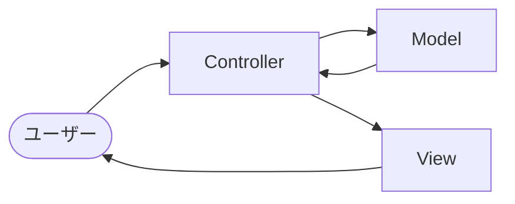
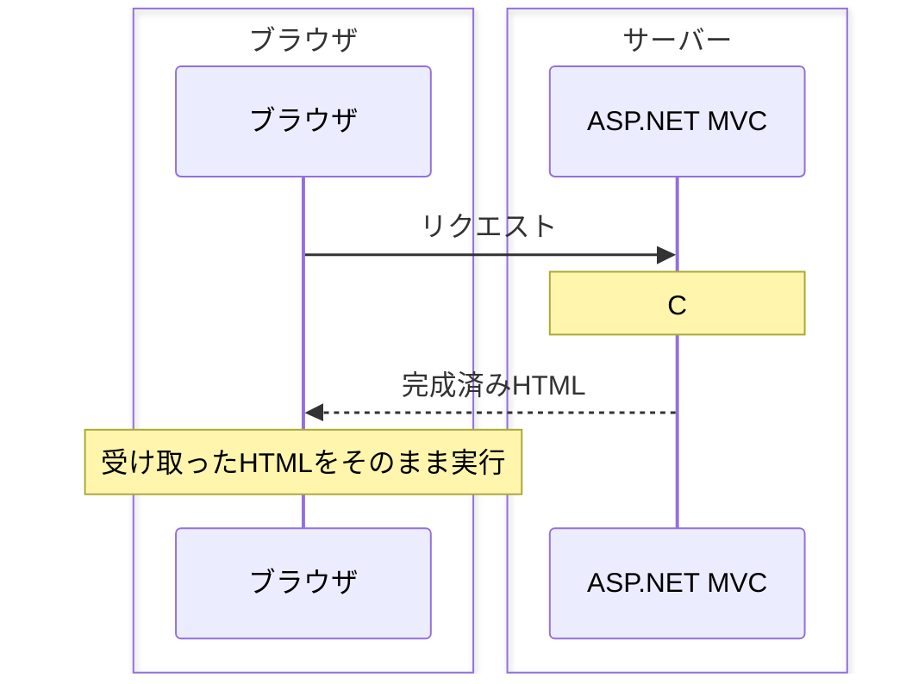

# ASP.NET MVC

## 概要
Microsoft が提供する Webアプリケーションフレームワーク。MVCパターンに基づき、Controller・Model・View の3つの役割でコードを分離する。

## 理解したこと

### MVCの3つの役割

| 役割 | 担当 | 内容 |
|------|------|------|
| M（Model） | ビジネスロジックの大枠 | データの処理・計算・DBとのやり取り |
| V（View） | 画面表示 | ユーザーが見る画面のUI・出力 |
| C（Controller） | 全体の制御 | ユーザーの入力を受け付け、M と V へ指示を出す |



---

### ECサイトで見るMVC構造

Modelは「1つの機能だけを担当するクラス（ServiceClass）」ではなく、**複数の機能を内包する大枠**。

```
ECサイトのシステム
├── Controller（受付）
│    ├── CartController     … カートの操作を受け付けるクラス
│    └── ProductController  … 商品画面の表示を受け付けるクラス
│
├── Model（ロジックの集まり）
│    ├── CartService    … カートに商品を追加する「計算・チェック」のクラス
│    ├── StockManager   … 在庫を減らす「処理」のクラス
│    └── CartData       … カート内の「データ」そのもの
│
└── View（画面）
     ├── product_detail.html  … 商品詳細画面
     └── cart_list.html       … カート中身の一覧画面
```

---

### ビジネスロジックの書き場所

「判断の余地がある処理」はModelに書く。

| 書く場所 | 適切か |
|---------|--------|
| View | ❌ |
| Controller | ❌ |
| Model | ✅ |

**判断の余地がある** = 仕様変更が起きうる部分。

「70点以上は合格」のような**判断基準**はModel。「リストをループして並べる」のような**ただの表示処理**はViewに書いてよい。

---

### URLルーティング

```csharp
name: "default",
pattern: "{controller=Home}/{action=Index}/{id?}");
```

| プレースホルダ | 意味 |
|---|---|
| `{controller=Home}` | デフォルトのコントローラー名 |
| `{action=Index}` | デフォルトのアクション名 |
| `{id?}` | 省略可能なID |

---

### Viewのファイル構成

```
Views/
└── コントローラー名/
    └── アクション名.cshtml
```

アクション名 = ユーザーがやりたい具体的な操作の名前（例：`Index` → 一覧を表示する操作）

---

### Razor構文

`.cshtml` ファイル内でC#を書ける。`@` がRazorの目印。

| 構文 | 説明 |
|------|------|
| `@* コメント *@` | コメント |
| `@(スクリプト)` | その瞬間の実行結果を出力 |
| `@{ スクリプト }` | ブロック。変数定義などに使う（共有スコープ） |
| `@変数` | 変数の値を出力 |
| `@メソッド名` | メソッドの呼び出し |

```csharp
@if (score >= 60) {
    <div> @score </div>
}
```

---

### ControllerからViewへのデータ受け渡し

3種類の方法がある。ViewBagはViewDataのラッパーで実態は同じ。どちらもコンパイル時に型チェックされないため、型安全な `@model` が推奨。

| 方法 | 型 | 特徴 |
|------|-----|------|
| `ViewData` | `Dictionary<string, object>` | キャストが必要。コンパイル時に型チェックなし |
| `ViewBag` | `dynamic` | キャスト不要。プロパティ名は自由に決めるのでバグの温床になりやすい |
| `@model`（モデルバインディング） | 任意の型 | 型安全。コンパイル時チェックあり。推奨 |

```csharp
// ViewData（Controller側）
ViewData["name"] = "田中";
// View側
string name = ViewData["name"]?.ToString();

// ViewBag（Controller側）
ViewBag.FruitList = new List<string> { "りんご", "バナナ" };
// View側
@foreach (var fruit in ViewBag.FruitList) { <li>@fruit</li> }
```

---

### Null関連演算子（C#）

ViewDataとの組み合わせでよく使う。

| 演算子 | 名前 | 意味 |
|--------|------|------|
| `string?` | Null許容型 | nullが入ってもいい変数の型 |
| `?.` | Null条件演算子 | nullなら後ろの処理を無視して自身もnullになる |
| `??` | Null合体演算子 | nullだったら代わりの値を使う |

```csharp
string name  = ViewData["name"]?.ToString() ?? "";
int    score = int.Parse(ViewData["score"]?.ToString() ?? "0");
```

---

### リダイレクト

```csharp
return RedirectToAction("アクション名", "コントローラ名");
// コントローラ名は省略可（自身のコントローラになる）
```

コントローラーのアクションメソッドの出口は `return View()` か `return RedirectToAction()` のどちらか片方のみ。

**TempData**：リダイレクト先でもデータを引き継げる。

```csharp
[HttpPost]
public IActionResult Login(string username, string password)
{
    if (password == "1234")
    {
        return RedirectToAction("MyPage");
    }
    ViewData["ErrorMessage"] = "パスワードが違います。";
    return View();
}
```

---

### インスタンスの3レイヤー構造

MVCは「操作する」というより「勝手に連鎖する」イメージが正しい。

| レイヤー | 寿命 | 例 |
|---------|------|-----|
| 常駐レイヤー | アプリ起動〜終了まで | `WebApplication`、`ServiceProvider` |
| 仲介レイヤー | ユーザーの操作のたびに自動生成 | HTTPリクエスト・レスポンス |
| 使い捨てレイヤー | `return` 後に即破棄 | `HomeController`、`ViewResult` |

---

### C# と JavaScript の使い分け

| 担当 | 使う場面 |
|------|---------|
| C#（サーバー） | DBからのデータ取得・セッションチェック・隠したいロジック・`@for` でHTML生成 |
| JS（クライアント） | ポップアップ・送信前バリデーション・Ajax/Fetchでの部分更新・アニメーション |

---

### SSR（サーバーサイドレンダリング）

ASP.NET MVCはSSRのフレームワーク。`.cshtml` はサーバー側で動き、完成したHTMLをブラウザに届ける。



JSONをブラウザに渡してブラウザ側でHTMLを組み立てるSPA（React等）との対比が明確。

---

## 関連概念
- session_management（ログイン状態の管理。セッションIDとCookieの仕組み）
- http（HTTPメソッド・リクエスト/レスポンスの基礎）
- https（通信の暗号化。POSTと組み合わせて機密情報を守る）
- static_dynamic_content（SSRはサーバーで動的コンテンツを生成する方式）

## ソース
- 会話ベース 2026-06-10

## タグ
ASP.NET, MVC, Controller, View, Model, Razor, ViewData, ViewBag, ルーティング, SSR, C#, リダイレクト
