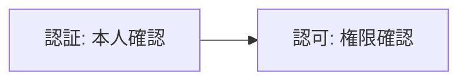

# 認証と認可

## 概要
認証(Authentication)は利用者が誰であるかをシステムが識別すること、認可(Authorization)は利用者に許可されているサービスの内容を確認すること。

## 理解したこと

### 認証と認可の違い

| | 認証（Authentication） | 認可（Authorization） |
|--|--|--|
| 確認すること | 利用者が誰であるか | 利用者が何を許可されているか |
| 問いの形 | あなたは誰ですか？ | あなたは何をしてよいですか？ |
| 具体例 | 社員証をかざしてログインする | 契約しているプランをWebサイトで確認する |

---

### 処理の順序

認証で「誰か」が確定して初めて、認可で「何をしてよいか」が判断できる。順序が逆転することはない。

## 関連概念
- [oauth2.md](oauth2.md)（認可を第三者アプリに安全に委任する具体的なプロトコル。認証と認可の分離を実例で扱う）
- [information_security_properties.md](information_security_properties.md)（真正性の実現手段の一つが認証にあたる）

## ソース
- 2026-08-17・書籍「イラスト図解式 セキュリティの基本」第2章

## タグ
認証, 認可, アクセス制御, セキュリティ
