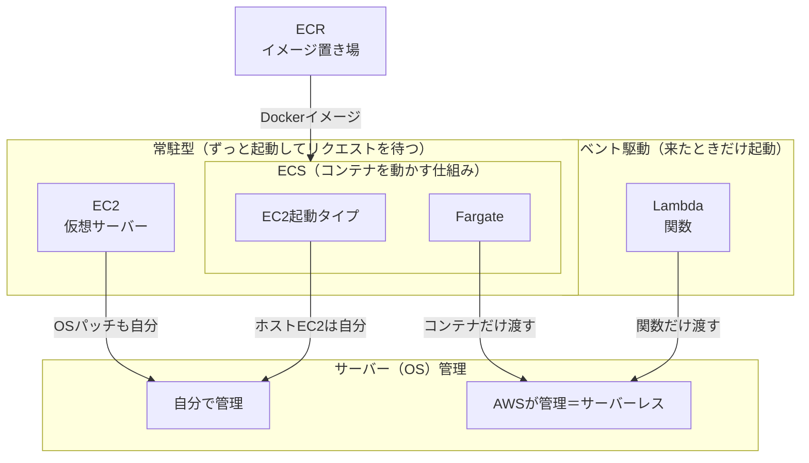

# AWSのコンピューティング（EC2 / ECS / Lambda）

## 概要
アプリを動かす場所の選択肢。EC2は仮想サーバー、ECSはDockerなどのコンテナ、Lambdaはサーバーレスで実行環境がAWS側に用意されており、関数だけを書く。

## 理解したこと

### 全体像

「コンテナかサーバーレスか」より「常駐かイベント駆動か」「誰がサーバーを管理するか」で分けると整理しやすい。



---

### ECS（Fargate）とLambdaの違い

Fargateも「サーバー管理不要」という意味ではサーバーレスと呼ばれる。本当の違いは動き方。

| | ECS（Fargate） | Lambda |
|---|---|---|
| 動き方 | 常駐型 | イベント駆動 |
| 持ち込むもの | Dockerイメージ（ECR） | 関数のコード（イメージも可） |
| 課金 | 起動している時間 | 実行回数 × 実行時間 |
| 制約 | ほぼなし | 最大15分・状態を持てない |

---

### Lambdaの「特殊な書き方」＝ハンドラ関数

待ち受け（ポートを開く）をAWSが担当するので、こちらは「イベントを受けて結果を返す関数」だけ書く。

```js
// ECSなど：自分でポートを開いて待つ
app.get('/users', (req, res) => res.json(users));
app.listen(3000);

// Lambda：イベントを受け取って返すだけ
export const handler = async (event) => {
  return { statusCode: 200, body: JSON.stringify(users) };
};
```

Lambda Web Adapterを使えばExpressなどをほぼそのまま載せられるので、「専用の書き方が必須」とまでは言えなくなっている。

---

### 選び方

| 状況 | 選択 |
|---|---|
| 常時アクセスあり・処理が長い/重い | ECS（またはEC2） |
| アクセスがまばら・処理が短い（15分以内） | Lambda |
| OSパッチなどの運用を減らしたい | EC2を避けFargate / Lambda |
| 既存システムの移行・OSを触りたい | EC2 |

---

## 関連概念
- [container.md](container.md)（ECSが動かすものの正体）
- [virtual_machine.md](virtual_machine.md)（EC2の正体）
- [cloud_service_models.md](cloud_service_models.md)（EC2はIaaS寄り、Fargate・LambdaはPaaS寄り）
- [aws_web_three_tier.md](aws_web_three_tier.md)（アプリ層としてどれを置くか）
- [ci_cd.md](ci_cd.md)（ECS・Lambdaではイメージ／関数の入れ替えでデプロイする）

## ソース
- 2026-09-29・https://www.c3index.co.jp/blog/blog_3145/
- 2026-09-29・https://note.com/ren_webstep/n/n22b2b94971fb

## タグ
AWS, EC2, ECS, Fargate, Lambda, サーバーレス, コンテナ, ECR, イベント駆動, ハンドラ
