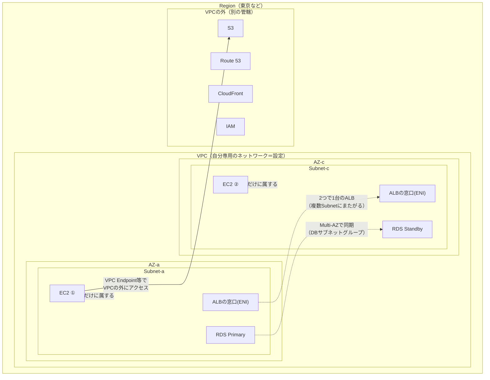

# AWS VPC（リソースの入れ子構造）

## 概要
AWS上に作る自分専用のネットワーク。Region → VPC → AZ → Subnet の入れ子の中に、ENIを介してEC2・ALB・RDSなどのリソースを置く。

## 理解したこと

### 全体像

構成図は「アイコン」より先に「どの枠の中にいるか」を見ると読める。

---

### VPCの中と外

S3はVPCとは別の管轄。VPCの中に置くのは「IPアドレスを持ってネットワークに参加するもの」だけ。

| 場所 | サービス例 | 特徴 |
|---|---|---|
| VPCの中 | EC2, ALB, RDS, ECS, NAT Gateway | Subnetに属し、ENI（＝IPアドレス）を持つ |
| VPCの外 | S3, Route 53, CloudFront, IAM, DynamoDB | リージョン単位・グローバルのサービス。エンドポイント（URL）経由で使う |

---

### 停止と削除は別物

「子から順に」の縛りがあるのは削除のほう。VPC・Subnetは「このIP範囲をこう区切る」という設定なので、そもそも停止がない。

| | 停止 | 削除 |
|---|---|---|
| VPC / Subnet | 概念がない（動いているものではない） | 中にリソース（ENI）が残っていると失敗する |
| EC2 | VPCと無関係に単独でできる | できる |
| RDS | できる（7日で自動起動） | できる |
| ALB | できない（置いている間は課金） | できる |

コンソールのVPC削除は、Subnet・ルートテーブル・IGWなどの「設定もの」はまとめて消すが、EC2・ALB・RDSなどの実体が残っていると止まる。

---

### Subnetとリソースの関係は1対1とは限らない

VPC → Subnet は厳密な入れ子だが、Subnet → リソース はリソースによって違う。

| リソース | Subnetとの関係 |
|---|---|
| EC2 | 必ず1つのSubnetに属する（きれいな入れ子） |
| ALB | 1つのALBが2つ以上のAZのSubnetにまたがる（作成時に指定必須） |
| RDS | DBサブネットグループ（2AZ以上のSubnetの束）を指定。本体は1AZ、Multi-AZで別AZに待機系 |

---

### ENI：「Subnetの中にいる」の正体

ENI（Elastic Network Interface）は仮想のLANカード。

リソースが「Subnetにいる」とは「そのSubnetにENIが置かれている」ということで、Subnetが削除できないときの原因もENI。

---

## 関連概念
- [subnet.md](subnet.md)（AWSのSubnetはこのサブネット化をAZ単位で行うもの）
- [cidr.md](cidr.md)（VPC・SubnetのIP範囲はCIDRで指定する）
- [cloud_infrastructure.md](cloud_infrastructure.md)（プライベートサブネット配置などのセキュリティ設計の実例）
- [aws_web_three_tier.md](aws_web_three_tier.md)（この入れ子の上に組む代表的な構成）
- [load_balancer.md](load_balancer.md)（ALBが複数Subnetにまたがる理由＝冗長化）

## ソース
- 2026-09-29・https://www.c3index.co.jp/blog/blog_3145/
- 2026-09-29・https://note.com/ren_webstep/n/n22b2b94971fb

## タグ
AWS, VPC, Subnet, AZ, ENI, ALB, RDS, S3, 構成図, インフラ, ネットワーク
