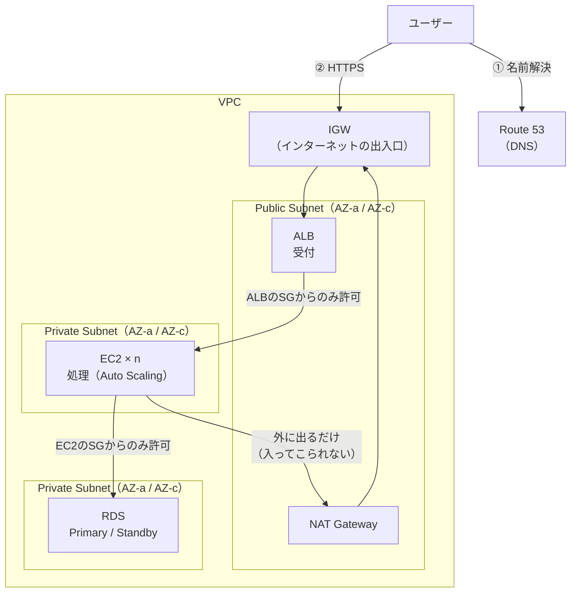

# Web三層構成（AWS）

## 概要
ALB（受付）→ EC2（処理）→ RDS（保存）の3層に分け、インターネットに見せるのは入口のALBだけにするAWSの基本構成。

## 理解したこと

### 全体像



---

### なぜこの形なのか

| 目的 | 実現方法 |
|---|---|
| セキュリティ | 外に出すのはALBだけ。EC2・RDSはPrivate Subnetに隠す |
| スケール | ALBの後ろにEC2を並べ、Auto Scalingで台数を自動増減 |
| 可用性 | ALB・EC2は2AZにまたがって配置、RDSはMulti-AZで自動フェイルオーバー |
| 役割分担 | 受付・処理・保存を分け、1つの層の変更が他に響きにくい |

---

### セキュリティグループ（SG）の連鎖

許可元をIPではなくSGで指定するので、EC2が増減してIPが変わってもルールはそのまま。

```
ALB SG : 443  ← 0.0.0.0/0
EC2 SG : 80   ← ALB SG
RDS SG : 3306 ← EC2 SG
```

---

### フロントを分けると「APIサーバー」になる

フロントはS3＋CloudFrontでやって、アプリケーションは別の構成でAPIで繋ぐ形が今も定番。昔の王道は「三層だけで完結（EC2がHTMLを返す）」の方。

| 時期 | 主流 | HTMLを作る場所 |
|---|---|---|
| 〜2010年代前半 | 三層で完結（Rails, PHPなど） | サーバー（EC2） |
| 2010年代中盤〜 | フロント（SPA）とAPIを分離 | ブラウザ |
| 最近 | SSRへの揺り戻し（Next.jsなど） | 両方 |

これらは置き換わったのではなく用途で使い分け（管理画面・SaaS → 分離、SEO重視のメディア・EC → SSR）。

分離すると三層構成は「画面を返す」役を手放し、JSONを返すAPIに専念する。ALBは「画面の層」ではなく単なる入口になる。

---

### APIサーバーの作り方

EC2の部分を置き換えるだけで形は同じ、というのが上2つ。Lambdaだけは常駐サーバーを持たない。

| 構成 | 向いているケース |
|---|---|
| ALB + EC2 + RDS | 既存システムの移行、OSまで触りたい |
| ALB + ECS Fargate + RDS | いま新規で作るならこれが多い |
| API Gateway + Lambda + DynamoDB/RDS | アクセスがまばら・小さく始めたい |

違いの詳細は [aws_compute_services.md](aws_compute_services.md)。

---

## 関連概念
- [aws_vpc.md](aws_vpc.md)（この構成が乗っている入れ子構造・ALBが複数Subnetにまたがる理由）
- [s3_cloudfront_oac.md](s3_cloudfront_oac.md)（フロントを分離したときの配信側。「入口だけ見せる」考え方が共通）
- [aws_compute_services.md](aws_compute_services.md)（アプリ層をEC2・ECS・Lambdaのどれで作るか）
- [load_balancer.md](load_balancer.md)（ALBの役割そのもの）
- [nat_napt.md](nat_napt.md)（Private SubnetのEC2が外に出るときの仕組み）
- [n_tier_architecture.md](n_tier_architecture.md)（こちらはコード内部の層分割。インフラの層分割とは別物）

## ソース
- 2026-09-29・https://www.c3index.co.jp/blog/blog_3145/
- 2026-09-29・https://note.com/ren_webstep/n/n22b2b94971fb

## タグ
AWS, 三層構成, ALB, EC2, RDS, Multi-AZ, Auto Scaling, セキュリティグループ, NAT Gateway, SPA, API, インフラ
