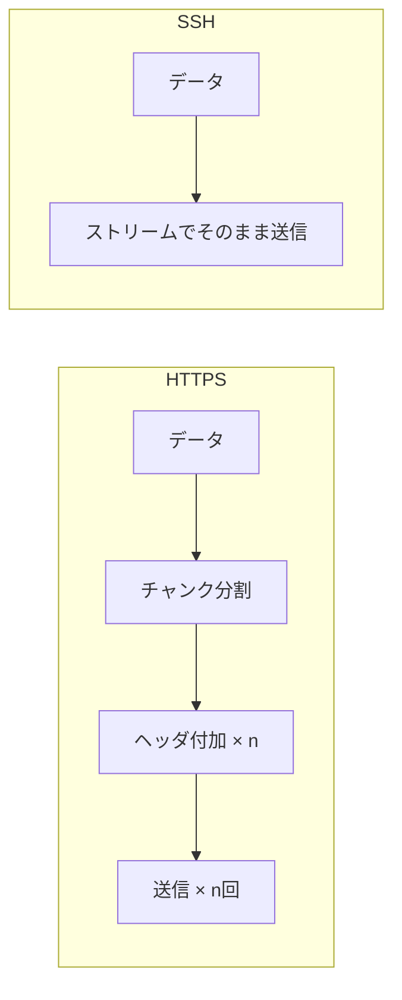

# チャンクとオーバーヘッド

## 概要
通信の文脈で頻出する2つの基礎用語。チャンクはデータの分割単位、オーバーヘッドは本来の処理以外にかかるコスト。

## なぜ必要か
通信では「データをどう送るか」によって処理コストが変わる。チャンクとオーバーヘッドを理解することで、なぜHTTPSとSSHで通信効率が異なるかが説明できる。

## 用語の整理

| 用語 | 意味 | 例 |
|---|---|---|
| チャンク | 大きなデータを分割した1かたまり | HTTPSの1送信単位 |
| オーバーヘッド | 本来の処理以外にかかるコストの総称 | ヘッダ付加・分割処理・ACK待ち |

チャンクが多くなるほどオーバーヘッドも増える（分割・ヘッダ付加・確認待ちが繰り返されるため）。

## HTTPS vs SSH の比較

SSHはつなぎっぱなしで流す設計のため、チャンク分割のオーバーヘッドが少ない。

## 関連概念
- encapsulation.md（ヘッダ付加＝カプセル化もオーバーヘッドの一種）
- network_performance.md（スループット・遅延との関係）
- ssh.md（ストリーム接続の利点の文脈で登場）

## ソース
- 2026-05-08・会話での説明（SSH vs HTTPSの文脈）

## タグ
チャンク, オーバーヘッド, 通信効率, ストリーム, HTTP, SSH
