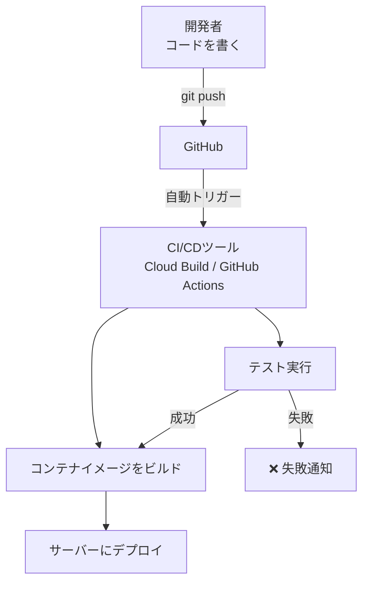

# CI/CD

## 概要
「コードを書く → テスト → デプロイ」を自動化するパイプライン。

## 理解したこと
- CI（継続的インテグレーション）：コードをpushするたびに自動でテストを実行する
- CD（継続的デリバリー/デプロイ）：テストが通ったら自動でサーバーに反映する
- 手動デプロイのミスや漏れをなくし、常に最新のコードが動いている状態を保つ

## 典型的な流れ
```
GitHub に push
  ↓ 自動トリガー
CI/CDツール（Cloud Build / GitHub Actions など）
  ├→ テスト実行
  ├→ コンテナイメージをビルド
  └→ サーバーにデプロイ
```

## ツール選定のポイント（GCPの例）
- Cloud Build：GCP内で完結するためIAM権限だけでセキュア。外部サービスに鍵を渡さなくていい
- GitHub Actions：汎用的だがGCPへの認証設定が必要になる

## 構成図

<!-- 2026-03-30 -->


## 関連概念
- cloud_infrastructure
- harness_engineering（自動化・フィードバックループの思想が共通）

## ソース
- 2026-03-08・https://zenn.dev/so_engineer/articles/728f4336a0aac4

## タグ
CI/CD, 自動化, デプロイ, Cloud Build, GitHub Actions, 開発フロー
