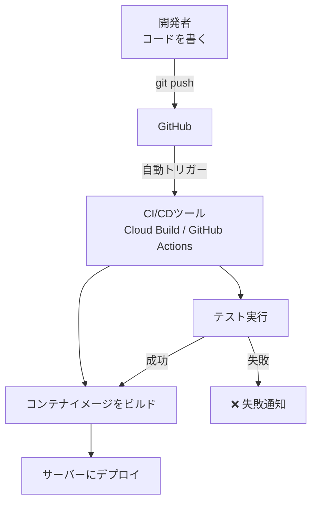

# CI/CD

## 概要
「コードを書く → テスト → デプロイ」を自動化するパイプライン。

## 理解したこと
- CI（継続的インテグレーション）：コードをpushするたびに自動でテストを実行する
- CD（継続的デリバリー/デプロイ）：テストが通ったら自動でサーバーに反映する
- 手動デプロイのミスや漏れをなくし、常に最新のコードが動いている状態を保つ

## 典型的な流れ
```
GitHub に push
  ↓ 自動トリガー
CI/CDツール（Cloud Build / GitHub Actions など）
  ├→ テスト実行
  ├→ コンテナイメージをビルド
  └→ サーバーにデプロイ
```

## ツール選定のポイント（GCPの例）
- Cloud Build：GCP内で完結するためIAM権限だけでセキュア。外部サービスに鍵を渡さなくていい
- GitHub Actions：汎用的だがGCPへの認証設定が必要になる

## 構成図

<!-- 2026-03-30 -->

```mermaid
graph TD
    Dev["開発者<br/>コードを書く"] -->|git push| GitHub
    GitHub -->|自動トリガー| CI["CI/CDツール<br/>Cloud Build / GitHub Actions"]
    CI --> Test["テスト実行"]
    CI --> Build["コンテナイメージをビルド"]
    Build --> Deploy["サーバーにデプロイ"]
    Test -->|失敗| Fail["❌ 失敗通知"]
    Test -->|成功| Build
```

## セキュリティリスク（TanStack事件より）
CI/CDパイプライン自体が攻撃対象になりうる。特にキャッシュは「信頼境界をまたぐ」ため危険。

| リスク | 内容 | 対策 |
|--------|------|------|
| pull_request_target の悪用 | fork PR でも secret にアクセスできるトリガー。マージ前でも実行される | fork PR では secret を渡さない設計にする |
| キャッシュ汚染 | untrusted な PR ビルドのキャッシュが release ビルドに流用されると悪性コードが混入 | PR用とrelease用でキャッシュキーを分離する |
| 権限の過剰付与 | `id-token: write` を全 job に付与すると OIDC トークンをどの job でも奪取可能 | publish job のみに限定する |

## 関連概念
- cloud_infrastructure
- harness_engineering（自動化・フィードバックループの思想が共通）
- github_actions_security（GitHub Actions 固有のセキュリティ詳細）
- supply_chain_attack（CI/CDが踏み台になるワーム型攻撃）

## ソース
- 2026-03-08・https://zenn.dev/so_engineer/articles/728f4336a0aac4
- 2026-06-03・https://zenn.dev/trknhr/articles/69c01c843329d0

## タグ
CI/CD, 自動化, デプロイ, Cloud Build, GitHub Actions, 開発フロー, セキュリティ
