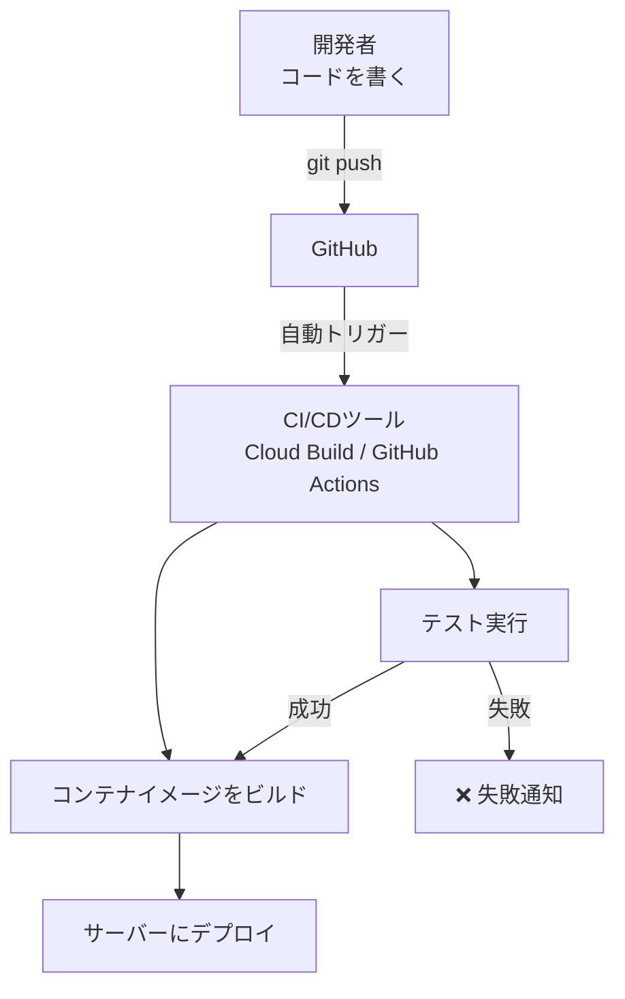

# CI/CD

## 概要
「コードを書く → テスト → デプロイ」を自動化するパイプライン。

## 理解したこと

### CI と CD の違い

| | 説明 |
|--|--|
| CI（継続的インテグレーション） | コードをpushするたびに自動でテストを実行する |
| CD（継続的デリバリー/デプロイ） | テストが通ったら自動でサーバーに反映する |

手動デプロイのミスや漏れをなくし、常に最新のコードが動いている状態を保つ。

---

### 構成図

```mermaid
graph TD
    Dev["開発者<br/>コードを書く"] -->|git push| GitHub
    GitHub -->|自動トリガー| CI["CI/CDツール<br/>Cloud Build / GitHub Actions"]
    CI --> Test["テスト実行"]
    CI --> Build["コンテナイメージをビルド"]
    Build --> Deploy["サーバーにデプロイ"]
    Test -->|失敗| Fail["❌ 失敗通知"]
    Test -->|成功| Build
```

---

### 手動デプロイからの変化

従来はEC2にWindows OSを入れ、RDPで接続してIISに手動でコピペしていた。それを自動化したのがCI/CD。コピペを置き換えるのは主にCDだが、その手前の「ちゃんと動くか」（CI）もセットで自動化する。

| 工程 | 従来（手動） | CI/CD |
|--|--|--|
| ビルド・テスト | 手元でやる／やらない | push のたびに自動（CI） |
| 配置 | RDPで接続 → IISにコピペ | パイプラインが自動で配置（CD） |

---

### イミュータブルインフラストラクチャ

「動いているものは直さず、作り直して入れ替える」考え方。ECS・Lambdaではサーバーにログインする場面自体がなくなる。

| | 従来 | イミュータブル |
|--|--|--|
| デプロイ | 動いているサーバーのファイルを上書き | 新しいイメージで丸ごと入れ替え |
| 環境の状態 | サーバーごとにばらつく | 同じイメージから起動するので揃う |
| ロールバック | 手で戻す | 前のイメージに戻すだけ |

---

### ツール選定のポイント（GCPの例）

| ツール | 特徴 |
|--|--|
| Cloud Build | GCP内で完結。IAM権限だけでセキュア。外部サービスに鍵を渡さなくていい |
| GitHub Actions | 汎用的。GCPへの認証設定が必要になる |
| CodePipeline / CodeBuild / CodeDeploy | AWSのCI/CDサービス群 |

---

### セキュリティリスク（TanStack事件より）

CI/CDパイプライン自体が攻撃対象になりうる。特にキャッシュは「信頼境界をまたぐ」ため危険。

| リスク | 内容 | 対策 |
|--------|------|------|
| pull_request_target の悪用 | fork PR でも secret にアクセスできるトリガー。マージ前でも実行される | fork PR では secret を渡さない設計にする |
| キャッシュ汚染 | untrusted な PR ビルドのキャッシュが release ビルドに流用されると悪性コードが混入 | PR用とrelease用でキャッシュキーを分離する |
| 権限の過剰付与 | `id-token: write` を全 job に付与すると OIDC トークンをどの job でも奪取可能 | publish job のみに限定する |

---

## 関連概念
- [git.md](git.md)（git push がCI/CDのトリガーになる）
- [cloud_infrastructure.md](cloud_infrastructure.md)（デプロイ先のインフラ基盤）
- [aws_compute_services.md](aws_compute_services.md)（イメージ・関数の入れ替えでデプロイする先）
- [harness_engineering.md](harness_engineering.md)（自動化・フィードバックループの思想が共通）
- [github_actions_security.md](github_actions_security.md)（GitHub Actions 固有のセキュリティ詳細）
- [supply_chain_attack.md](supply_chain_attack.md)（CI/CDが踏み台になるワーム型攻撃）

## ソース
- 2026-03-08・https://zenn.dev/so_engineer/articles/728f4336a0aac4
- 2026-06-03・https://zenn.dev/trknhr/articles/69c01c843329d0
- 2026-09-29・https://www.c3index.co.jp/blog/blog_3145/
- 2026-09-29・https://note.com/ren_webstep/n/n22b2b94971fb

## タグ
CI/CD, 自動化, デプロイ, Cloud Build, GitHub Actions, 開発フロー, セキュリティ, イミュータブルインフラ, AWS, CodePipeline
