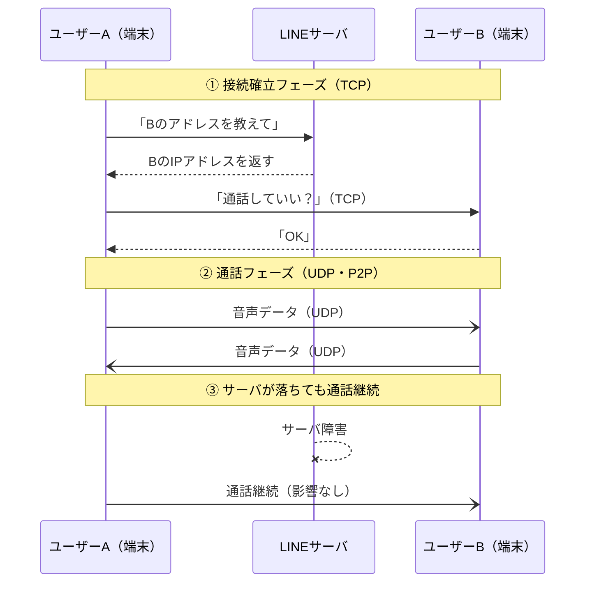
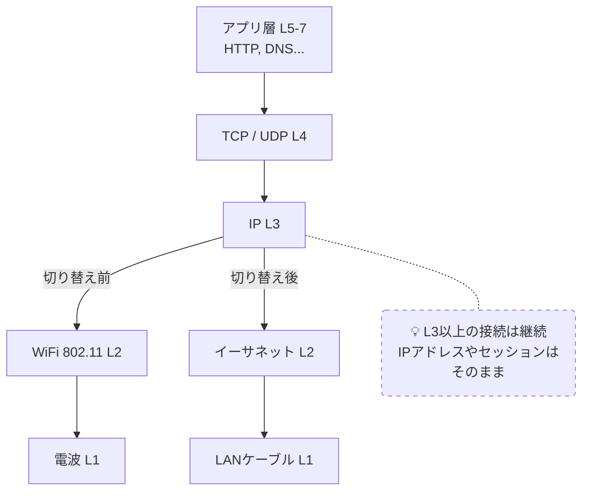

# クライアントサーバ型 vs ピアツーピア型

## 概要
コンピュータ同士の関係を表す2つのネットワーク構成モデル。

## 理解したこと

| | クライアントサーバ型 | ピアツーピア型（P2P） |
|---|---|---|
| 構造 | サーバが処理を担い、クライアントは表示のみ | 端末同士が対等に直接やり取り |
| 保守性 | サーバにリソースを集中できる | 分散するため保守コストが高い |
| 耐障害性 | サーバが単一障害点になる | 一部が落ちても全体に影響しない |
| 例 | Webサービス・ファイルサーバ | LINE通話・BitTorrent |

**P2Pの仕組み（LINE通話の例）**
1. 接続確立時だけサーバに「相手のIPアドレスを教えて」と問い合わせる（TCP）
2. IPアドレスが判明したら以降はサーバを経由せず直接通信（UDP）
3. LINEサーバが落ちても通話中のセッションは継続できる

**OSIレイヤーとの関係**
- 接続確立フェーズ：L4=TCP（確実性優先）
- 通話本体フェーズ：L4=UDP（速さ・リアルタイム性優先）
- L3以下（IP・物理）は両フェーズで共通して使い回す
- これがレイヤー化の「機能の組み替えが容易」というメリットの具体例

**レイヤー差し替えの他の例**
- HTTPSへの切り替え：L6にTLSが追加されるだけ、L4以下は変わらない
- WiFiから有線LANへの切り替え：L1・L2が変わるだけ、L3以上の接続は継続される

## 構成図（LINE通話の流れ）

<!-- イラスト図解式ネットワークの基本 1章 / 2026-03-30 -->

## 構成図（WiFiから有線LANへの切り替え）

<!-- イラスト図解式ネットワークの基本 1章 / 2026-03-30 -->

## 関連概念
- osi_model.md
- layered_architecture.md

## ソース
- 2026-03-28・「イラスト図解式 ネットワークの基本」第1章

## タグ
ネットワーク, クライアントサーバ, P2P, アーキテクチャ, インフラ
