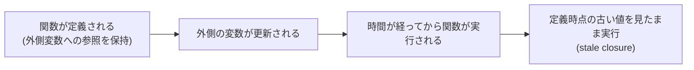

# クロージャ

## 概要
関数が、自分が定義された時点の外側スコープの変数を、実行される時まで参照し続ける仕組み。

## 理解したこと

### 基本の仕組み
外側の関数が終了して本来ローカル変数が消えるはずのタイミングでも、内側で定義されて外に返された関数は、外側スコープの変数への参照を保持し続ける。

```js
function makeCounter() {
  let count = 0;

  function increment() {
    count = count + 1;
    console.log(count);
  }

  return increment;
}

const counter = makeCounter();
counter(); // 1
counter(); // 2
counter(); // 3
```

`increment`が`count`を「閉じ込めて持ち歩いている」イメージから、closure（閉じる）と呼ばれる。

---

### 問題になるのは「作られたタイミング」と「実行タイミング」にズレがある時
クロージャ自体はバグではない。問題が表面化するのは、関数が作られてから実際に実行されるまでの間に外側の変数が更新されてしまうケース（stale closure）。



`setInterval`・`setTimeout`・イベントリスナーの登録など、一度登録すると使い回される系のコールバックで特に起きやすい。

## 関連概念
- react_use_effect（依存配列`[]`で1回だけ作られたコールバックがstateの古い値を覚え続ける具体例）
- react_use_state（stale closureへの対策としての関数型の更新）

## 関連実装
- [react_basics](../coding/react_basics/) — setIntervalのコールバックがstaleなseconds/countを覚え続ける挙動を実際に確認した

## ソース
- 2026-08-02・/codeセッションでの実装・対話から整理

## タグ
JavaScript, クロージャ, スコープ, stale closure, 非同期
