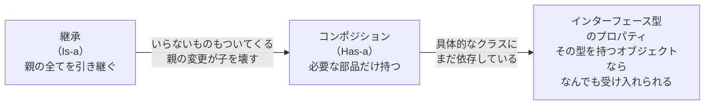

# コンポジション（Composition）

## 概要
クラスのプロパティに別のクラスのインスタンスを「部品として持つ」設計パターン。
継承（Is-a）ではなく「Has-a（〜を持つ）」という関係でオブジェクトを組み合わせる。

## 設計の進化：継承 → コンポジション → インターフェース



- **継承**：「HeroはCharacterの一種」として全てを引き継ぐ。いらないものもついてくる。
- **コンポジション**：プロパティにクラスを型として持つことで、「HeroはWeaponを持つ」という関係を表現する。必要な部品だけ選んで持てるため、継承の問題を解決した。
- **インターフェース**：プロパティの型を具体クラスではなくインターフェースにする。コンポジションの考え方の上に乗っかり、「そのインターフェースの型を持つオブジェクトならなんでも受け入れられる」最大の柔軟性を実現した。

## 基本的な発想
「Attack() が欲しいなら継承するのではなく、攻撃する部品を持てばいい」という考え方。

```csharp
class Turret {
    private readonly IAttackable _attacker;  // インターフェース型で持つ

    public Turret(IAttackable attacker) {
        _attacker = attacker;
    }

    public void Attack() => _attacker.Attack();
}
```

## readonly による不変性の保証

| | 内容 |
|---|---|
| 設定できる箇所 | コンストラクタのみ |
| 目的 | 変化の起点を一箇所に限定し、問題の切り分けをしやすくする |
| 効果 | 意図しない上書き（バグ）をコンパイル時に防ぐ |

「誰がどの実装を使うか決める」責任はコンストラクタを呼ぶ側（外部）に明確化される。

## 継承との比較

| | 継承（Is-a） | コンポジション（Has-a） |
|---|---|---|
| 関係性 | 〜の一種 | 〜を持つ |
| 必要なものだけ取れるか | 親のすべてがついてくる | 必要な部品だけ持てる |
| 親変更の影響 | 子に波及する（密結合） | 最小限に抑えられる |
| 差し替え | 難しい | プロパティを変えるだけ |

## 関連概念
- inheritance
- oop_interface
- polymorphism

## ソース
- 2026-05-30：会話ベースの整理（C# .NET を題材に）

## タグ
コンポジション, OOP, Has-a, C#, readonly, 不変性, 設計パターン
