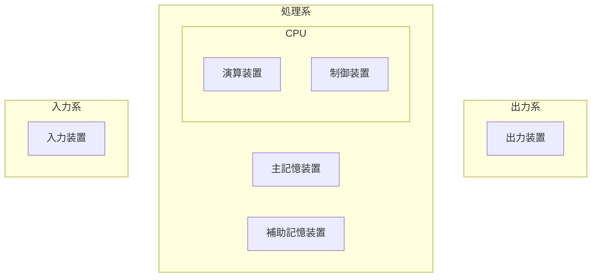

# コンピュータアーキテクチャ（5大装置）

## 概要
コンピュータは5大装置と補助記憶装置で構成される。CPUが制御装置と演算装置を内包し、主記憶装置と連携して処理を行う。

## 理解したこと

### 構成と役割

処理の主戦場は **主記憶装置（RAM）↔ CPU** の2つ。
補助記憶装置はデータの永続化として絡む。

---

### CPUの内部

| 構成要素 | 役割 |
|---|---|
| 制御装置 | 他の装置への指示・命令の解読。司令塔 |
| 演算装置 | 加算・比較などの純粋な計算処理 |
| レジスタ | 演算中の値の一時置き場（数十〜数百バイト） |

演算装置が直接読み書きするのはレジスタ。RAMとは直接やり取りしない。

---

## 関連概念
- memory_hierarchy（CPUと主記憶装置の間にある速度・容量の階層構造）

## ソース
- 2026-06-06：会話ベースの壁打ち

## タグ
5大装置, CPU, 制御装置, 演算装置, レジスタ, 主記憶装置, 補助記憶装置, ハードウェア, アーキテクチャ
