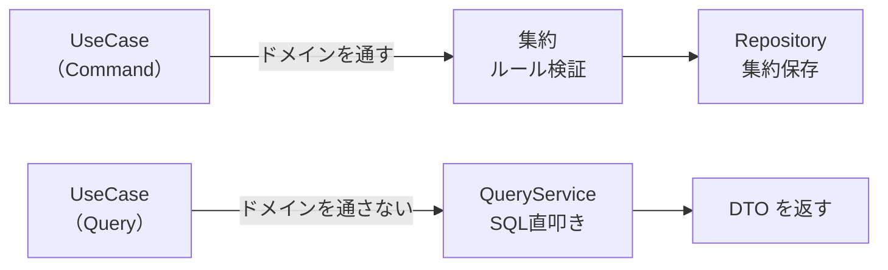
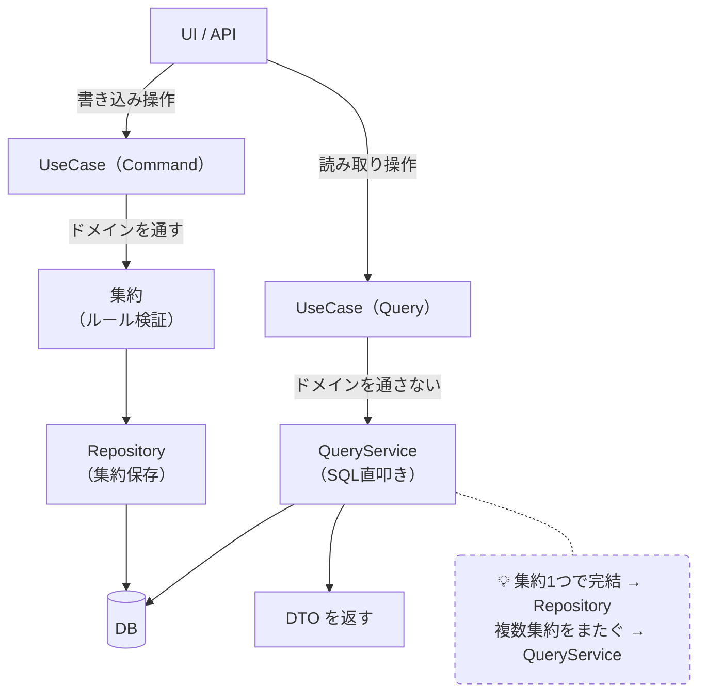

# CQRS（コマンドクエリ責務分離）

## 概要
書き込み（Command）と読み取り（Query）を別の経路・別の設計で扱うパターン。

## 理解したこと

### なぜ必要か
DDDのRepositoryは集約単位縛りがあるため、画面表示に必要な横断的データ取得が苦手。
書き込み（ビジネスルール保護）と読み取り（画面最適化）は性質が根本的に異なる。

### 2つの経路

### QueryService の配置ルール
- I/F（インターフェース）→ Application層（Repositoryと同じ構造）
- 実装（SQL） → Infrastructure層
- Application層はDBの種類を知らなくていい（DIPの適用）

### 集約1つかどうかの判断基準
- 集約1つで完結する → Repository で OK
- 複数集約をまたぐ（JOINが必要）→ QueryService を使う

### 段階的導入戦略
1. UseCaseをCommand/Queryで分類する
2. 集約横断JOINが必要な時点でQueryServiceを導入
3. 必要になったらReadモデル用DBを分離（後のオプション）

### よくある誤解
| 誤解 | 正しい理解 |
|---|---|
| ユースケースが不要になる | 消えない。振り分けるだけ |
| Command/Queryという名前必須 | 命名より内部ルールの統一が本質 |
| Query側もRepositoryを使うべき | N+1が起きる。QueryServiceを使う |
| QueryServiceはインフラ層に置く | I/FはApplication層に置く |

## 構成図

<!-- 2026-03-30 -->

## 関連概念
- ddd.md（DDDをやると自然にCQRSが必要になる）
- solid_principles.md（SRPの観点でもCommand/Query分離は正当化できる）
- dependency_inversion.md（QueryService I/FをApplication層に置く理由）

## ソース
- 2026-03-17・https://zenn.dev/135yshr/articles/9e3ec9a7d52c98

## タグ
CQRS, DDD, QueryService, Repository, Command, Query, アーキテクチャ, 設計パターン
