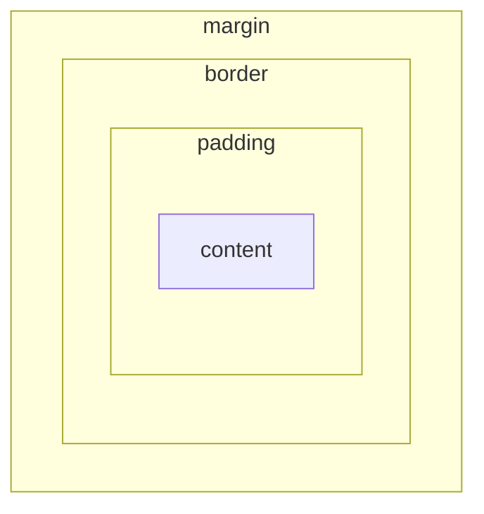

# CSSボックスモデル

## 概要
HTML要素は content・padding・border・marginの4層構造を持つ。

`box-sizing`は`width`/`height`がその層のどこまでを含むかを決める。

## 理解したこと

### 要素とタグの違い
タグはその境界を示すマークアップの記法（開始タグ・終了タグ）であり、要素そのものではない。

```
要素 = content + padding + border + margin
```

| 用語 | 指すもの |
|---|---|
| タグ | `<div>`や`</div>`のような開始・終了の記法 |
| 要素 | 開始タグ〜終了タグまでの全体（中身を含めた1つのまとまり） |

CSSのbox modelが適用されるのは「要素」単位。

---

### 4層構造
要素の見た目は「コンテンツ → パディング（内側余白） → ボーダー（境界線） → マージン（外側余白）」の4層が外側に向かって積み重なってできている。

要素の中身そのものがcontentであり、タグ自体ではない。

margin・border・paddingは「領域（帯）」、contentはその内側の空間にある実体。



さらに各領域はtop/right/bottom/leftの4方向に分かれていて、1〜4個の値で指定するショートハンドは時計回り（上→右→下→左）の順に対応する。

| 順番 | 方向 |
|---|---|
| 1 | top |
| 2 | right |
| 3 | bottom |
| 4 | left |

| 層（外側から） | 役割 |
|---|---|
| margin | 要素の外側の余白 |
| border | 境界線 |
| padding | 内側の余白 |
| content | 実際の内容（テキスト・画像・子要素） |

borderは太さ・スタイル・色の3つを指定できる（`border-width`・`border-style`・`border-color`、一括指定は`border: 太さ スタイル 色;`の順）。

```css
margin: 10px 20px 30px 40px;
/* 1:top 2:right 3:bottom 4:left */
```

---

### 各要素が自分専用のboxを持つ（入れ子構造）
4層構造はページ全体で1つではなく、**要素ひとつひとつ**が個別に持つ。

```html
<div class="wrapper">
  <p>Hello</p>
</div>
```

`wrapper`も`p`もそれぞれ独立したboxであり、`wrapper`のcontentは「中に入っている`<p>`要素（という別のbox）」になる。

混同しやすいポイント：divはborderと同義ではない。divはbox全体（4層すべて）を持つ要素で、borderはそのうちの1層（境界線）にすぎない。`border-width: 0`（デフォルト）でも、divはboxとして機能する。

---

### box-sizingがwidthの意味を変える
デフォルト（`content-box`）では`width`はcontentだけのサイズを指し、padding・borderはその外側に追加される。

`border-box`は`width`にpadding・borderを含めるため、指定した幅から要素がはみ出さない。

| box-sizing | widthが指す範囲 | padding/borderの扱い |
|---|---|---|
| `content-box`（デフォルト） | contentのみ | widthの外側に追加される |
| `border-box` | content + padding + border | widthの内側に収まる |

```css
* {
  box-sizing: border-box;
}
```

全要素に`border-box`を一括適用しておくのが実用上の定石。これをしないと、`width: 100%`にpaddingやborderを追加した要素が親からはみ出す。

marginはbox-sizingの設定に関わらず常にwidthの外側（除外される）。`border-box`という名前自体、「borderの外側のラインまでをboxの範囲とする」という意味に対応している。

---

## 関連概念
- css_flexbox（widthの計算がbox-sizingに依存する点で、レイアウト全体の前提になる）
- css_position（boxの「形」を決めるのがbox_model、boxを「どこに置くか」を決めるのがposition）

## 関連実装
- [booking_site_vanilla_js](../coding/booking_site_vanilla_js/) — input要素にwidth:100%+padding+borderを指定しつつ、box-sizing: border-boxで親要素からはみ出さないことを確認した

## ソース
- 2026-06-22・Qiita「CSSのボックスモデル」https://qiita.com/thirai67/items/647a96801082c273e188
- 2026-06-22・/codeセッションでの実装・対話から整理（box-sizing自体）
- 2026-06-24・/studyセッションでの壁打ちから整理（4層構造の入れ子・div≠borderの混同整理）

## タグ
CSS, ボックスモデル, box-sizing, レイアウト, padding, border, margin
