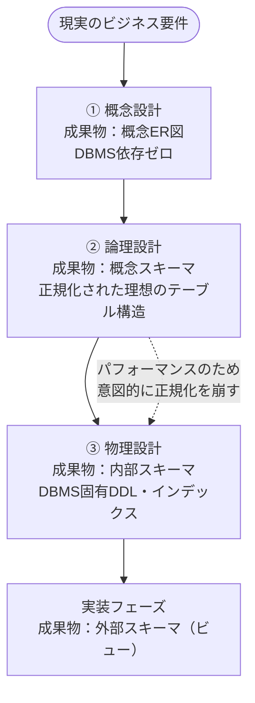

# DB設計の3ステップ

## 概要
データベース設計は「概念設計 → 論理設計 → 物理設計」の3ステップで進む。上流から下流へ進むにつれてDBMSへの依存度が高くなる。

## 設計の流れ

## 3ステップの全体像

| ステップ | 目的 | 成果物 | DBMS依存度 |
|---|---|---|---|
| 概念設計 | 現実世界のデータとその関係を整理 | 概念ER図 | ゼロ |
| 論理設計 | DBに乗せられる構造に変換 | 論理ER図・正規化後のテーブル定義 | 中（RDB/NoSQLの選択） |
| 物理設計 | 特定のDBMS製品に落とし込む | テーブル定義書（データ型・制約・インデックス） | 最大 |

## 設計ステップと3層スキーマの対応

| 設計ステップ | 対応するスキーマ | 備考 |
|---|---|---|
| 概念設計 | （なし） | 概念ER図はスキーマではなく前準備 |
| 論理設計 | 概念スキーマ | 正規化されたテーブル構造の完成形 |
| 物理設計 | 内部スキーマ | DBMS固有の実装 |
| 実装フェーズ | 外部スキーマ | テーブル完成後にビューを作成 |

「概念設計」は名前に「概念」が含まれるが、「概念スキーマ」を作るのは「論理設計」。ビジネスの言葉で整理する前準備が「概念設計」、それをDBの構造に翻訳する本番が「論理設計」。

## 論理設計は「物理層の制約にとらわれない」

特定のDBMS製品（MySQL・PostgreSQLなど）やサーバースペック（マシンパワー・容量）の都合を完全に無視して、「正しいデータ構造とは何か」だけに集中する。

この理想があるからこそ、物理設計での変更が「意図的なコントロール」になる：
- パフォーマンスのために、あえてここだけ正規化を崩す
- 製品の都合上、しかたなくここだけ型を狭める

論理設計なしに物理設計だけやると、崩した理由が後でわからなくなる。

## 正規化とパフォーマンスのトレードオフ

| | 正規化する | 正規化を崩す |
|---|---|---|
| データの整合性 | 高い | 低くなる |
| 取得時のJOIN | 必要（遅くなる） | 不要（速くなる） |
| 設計の意図 | 論理設計の理想形 | 物理設計での意図的な選択 |

**正しい手順：**
1. まず論理設計で完全に正規化した理想構造を作る
2. パフォーマンス問題が出たところだけ、物理設計で意図的に崩す

## 概念ER図 vs 論理ER図

| | 概念ER図 | 論理ER図 |
|---|---|---|
| 言葉 | ビジネスの言葉（「顧客が注文を持つ」） | DBの言葉（テーブル・カラム・主キー・外部キー） |
| 正規化 | しない | する（RDBの場合） |
| DBMSの影響 | ゼロ | RDB/NoSQLの選択が構造に影響する |

概念ER図は「現実の関係性を整理したもの」、論理ER図は「それをDBに乗せられる形に翻訳したもの」。翻訳なので内容は変わらず、言葉だけが変わる。

## 物理設計でDBMS依存度が最大になる理由

論理設計まで「どんな構造にするか」だったものが、物理設計では「特定のDBMS製品で動く定義」に落とし込む。データ型・インデックスの書き方はDBMSごとに異なるため、依存度が最大になる。

例：日付カラムの型指定
- MySQL：`DATE`
- PostgreSQL：`TIMESTAMP WITH TIME ZONE` など

## 関連概念
- dbms
- normalization
- database_models
- three_layer_schema

## ソース
- 2026-05-24：達人DB 第1章
- 2026-05-27：達人DB 第2章

## タグ
DB設計, 概念設計, 論理設計, 物理設計, ER図, 正規化, DBMS, 3層スキーマ, トレードオフ
