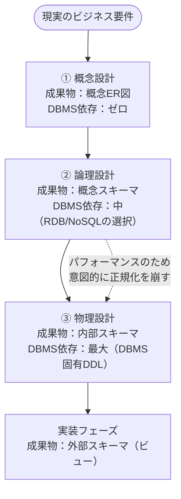

# DB設計の3ステップ

## 概要
データベース設計は「概念設計 → 論理設計 → 物理設計」の3ステップで進む。上流から下流へ進むにつれてDBMSへの依存度が高くなる。

## 設計の流れ

各ステップがどのスキーマ層に対応するかは → `three_layer_schema` 参照

## 論理設計の内部ステップ

| ステップ | 内容 |
|---|---|
| 1. エンティティの抽出 | どんな情報が必要かを洗い出す（発散フェーズ） |
| 2. エンティティの定義 | 抽出した概念を明確なルールに落とし込む（収束フェーズ） |
| 3. 正規化 | テーブル構造を整える |
| 4. ER図の作成 | リレーションを可視化する |

エンティティとは、テーブルになる前の概念的な「モノ・コト」。抽出が発散（何があるか）、定義が収束（どういうものか）の役割を持つ。

## 論理設計と正規化のトレードオフ

論理設計では物理層の制約を無視して「正しいデータ構造とは何か」だけに集中する。この理想があるからこそ、物理設計での変更が「意図的なコントロール」になる。

| | 正規化する | 正規化を崩す |
|---|---|---|
| データの整合性 | 高い | 低くなる |
| 取得時のJOIN | 必要（遅くなる） | 不要（速くなる） |
| 設計の意図 | 論理設計の理想形 | 物理設計での意図的な選択 |

まず完全に正規化した理想構造を作り、パフォーマンス問題が出たところだけ物理設計で意図的に崩す。論理設計なしだと崩した理由が後でわからなくなる。

## 概念ER図 vs 論理ER図

| | 概念ER図 | 論理ER図 |
|---|---|---|
| 言葉 | ビジネスの言葉（「顧客が注文を持つ」） | DBの言葉（テーブル・カラム・主キー・外部キー） |
| 正規化 | しない | する（RDBの場合） |
| DBMSの影響 | ゼロ | RDB/NoSQLの選択が構造に影響する |

概念ER図は「現実の関係性を整理したもの」、論理ER図は「それをDBに乗せられる形に翻訳したもの」。翻訳なので内容は変わらず、言葉だけが変わる。

## 関連概念
- dbms
- normalization
- database_models
- three_layer_schema

## ソース
- 2026-05-24：達人DB 第1章
- 2026-05-27：達人DB 第2章
- 2026-05-28：達人DB 第2章

## タグ
DB設計, 概念設計, 論理設計, 物理設計, ER図, 正規化, DBMS, 3層スキーマ, トレードオフ, エンティティ
