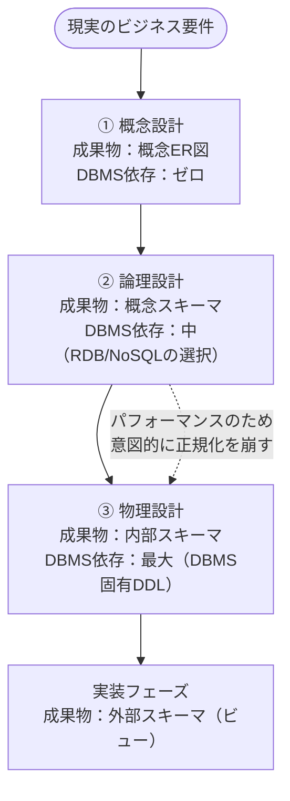

# DB設計の3ステップ

## 概要
データベース設計は「概念設計 → 論理設計 → 物理設計」の3ステップで進む。上流から下流へ進むにつれてDBMSへの依存度が高くなる。

## 設計の流れ

```mermaid
flowchart TD
    Start([現実のビジネス要件])
    --> A["① 概念設計\n成果物：概念ER図\nDBMS依存：ゼロ"]
    --> B["② 論理設計\n成果物：概念スキーマ\nDBMS依存：中（RDB/NoSQLの選択）"]
    --> C["③ 物理設計\n成果物：内部スキーマ\nDBMS依存：最大（DBMS固有DDL）"]
    --> D["実装フェーズ\n成果物：外部スキーマ（ビュー）"]

    B -.->|"パフォーマンスのため\n意図的に正規化を崩す"| C
```

各ステップがどのスキーマ層に対応するかは → `three_layer_schema` 参照

## 論理設計の内部ステップ

| ステップ | 内容 |
|---|---|
| 1. エンティティの抽出 | どんな情報が必要かを洗い出す（発散フェーズ） |
| 2. エンティティの定義 | 抽出した概念を明確なルールに落とし込む（収束フェーズ） |
| 3. 正規化 | テーブル構造を整える |
| 4. ER図の作成 | リレーションを可視化する |

エンティティとは、テーブルになる前の概念的な「モノ・コト」。抽出が発散（何があるか）、定義が収束（どういうものか）の役割を持つ。

## 物理設計の5つのタスク

| タスク | 内容 |
|---|---|
| テーブル定義 | 論理モデル（ER図）を物理モデル（実際のテーブル）に変換する |
| インデックス定義 | パフォーマンス向上のための索引を設定する |
| ハードウェアのサイジング | 必要なCPU・メモリ・ストレージの規模を見積もる |
| ストレージの冗長構成決定 | データ消失を防ぐための冗長化方式を決める |
| ファイルの物理的配置 | ストレージ上のファイル配置を決める |

### ハードウェアのサイジング

**キャパシティ**と**パフォーマンス**の2軸で考える。ストレージはその両方に関わる。

#### キャパシティ（容量）

必要なストレージ容量の見積もり。以下2つの合算で算出する。

| 要素 | 内容 |
|---|---|
| 初期データ量 | テーブル・インデックス定義が確定しないと算出不可。画像・HTML等のファイル分も加算 |
| 運用終了時のデータ増加量 | サービス期間中の増加を見越しておかないと、途中でストレージ不足になる |

初期データ量の算出は**論理設計の完了が前提**。インデックスは設計次第で大きく増えるため、確定後でないと正確に見積もれない。

**データ増加量が読めない場合の3つのアプローチ**

| # | アプローチ | 内容 |
|---|---|---|
| 1 | 安全率を大きく取る | 余裕を持ったサイジングで設計段階で吸収 |
| 2 | 増設できる構成にする | オンプレミスで補助記憶装置を後から追加できるよう拡張余地を確保 |
| 3 | クラウドを利用する | ストレージ容量を運用しながら漸増できる |

#### パフォーマンス（性能要件）

性能要件は以下2つの指標で定義する。

| 指標 | 一言 | 定義 | 単位 |
|---|---|---|---|
| レスポンスタイム | どれだけ**早く**処理できるか | 特定の処理を何秒以内に完了するか | 秒 |
| スループット | どれだけ**たくさん**処理できるか | 単位時間あたりにどれだけの処理をこなせるか | TPS / QPS |

**TPS と QPS の違い**

| 指標 | 粒度 | 意味 |
|---|---|---|
| TPS（Transactions Per Second） | 業務の処理単位 | 1秒あたりのトランザクション数。システム全体で使われる汎用的な指標 |
| QPS（Queries Per Second） | SQLの実行単位 | 1秒あたりのクエリ数。DB特有の指標 |

レスポンスタイムとスループットは基本的に連動するが、バルク処理や限界負荷時には明確にトレードオフの関係になる（スループットを上げると1件あたりのレスポンスタイムが長くなる）。

### ストレージI/Oネック

CPU・メモリ・ストレージには圧倒的な速度格差がある。メモリ上にデータがなければストレージへのアクセスが発生し、その間CPUが何もできずに待つ（**I/Oウェイト**）。これがストレージのI/Oネック。

> DBの性能問題の8割はストレージのI/Oネックによって起こる。

## 論理設計と正規化のトレードオフ

論理設計では物理層の制約を無視して「正しいデータ構造とは何か」だけに集中する。この理想があるからこそ、物理設計での変更が「意図的なコントロール」になる。

| | 正規化する | 正規化を崩す |
|---|---|---|
| データの整合性 | 高い | 低くなる |
| 取得時のJOIN | 必要（遅くなる） | 不要（速くなる） |
| 設計の意図 | 論理設計の理想形 | 物理設計での意図的な選択 |

まず完全に正規化した理想構造を作り、パフォーマンス問題が出たところだけ物理設計で意図的に崩す。論理設計なしだと崩した理由が後でわからなくなる。

正規化（整合性）とパフォーマンスはトレードオフの関係にある（**二律背反の原則**）。DB設計とは、予算という制約の中でその平衡点を探る作業。

## 概念ER図 vs 論理ER図

| | 概念ER図 | 論理ER図 |
|---|---|---|
| 言葉 | ビジネスの言葉（「顧客が注文を持つ」） | DBの言葉（テーブル・カラム・主キー・外部キー） |
| 正規化 | しない | する（RDBの場合） |
| DBMSの影響 | ゼロ | RDB/NoSQLの選択が構造に影響する |

概念ER図は「現実の関係性を整理したもの」、論理ER図は「それをDBに乗せられる形に翻訳したもの」。翻訳なので内容は変わらず、言葉だけが変わる。

## 関連概念
- dbms（物理設計はDBMS固有のDDLに最も依存する）
- normalization（論理設計で正規化し、物理設計でそのトレードオフを判断する）
- database_models（RDB/NoSQLの選択が論理設計の構造に影響する）
- three_layer_schema（概念・論理・物理の各ステップがそれぞれのスキーマ層に対応する）

## ソース
- 2026-05-24：達人DB 第1章
- 2026-05-27：達人DB 第2章
- 2026-05-28：達人DB 第2章
- 2026-06-01：達人DB 第2章
- 2026-06-02：達人DB 第2章

## タグ
DB設計, 概念設計, 論理設計, 物理設計, ER図, 正規化, DBMS, 3層スキーマ, トレードオフ, エンティティ, インデックス, ハードウェアサイジング, I/Oネック
