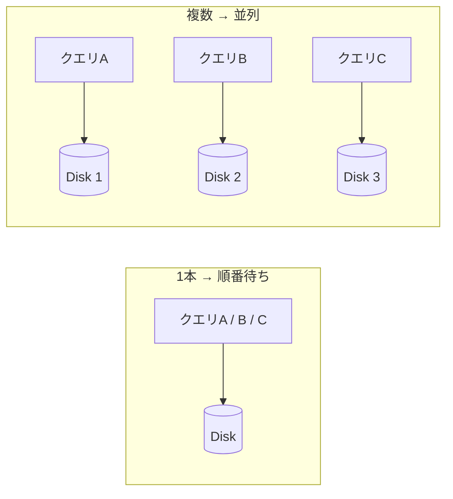
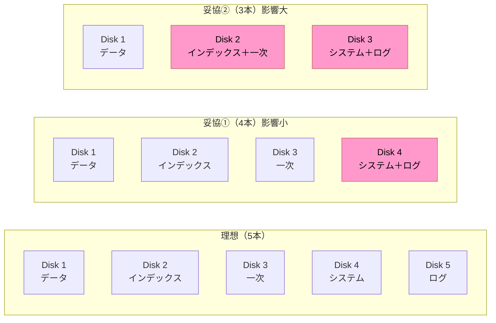

# DBファイルの物理配置

## 概要
データベースを構成する5種類のファイルを、どの物理ディスクに配置するかを決める設計。I/Oの分散が目的であり、論理的な分離だけでは物理的な負荷分散にならない。

## 理解したこと

### データベースを構成する5つのファイル

| ファイル | 役割 | 担当 |
|---|---|---|
| データファイル | テーブルのレコードを永続保存 | 開発者 |
| インデックスファイル | 高速検索のための索引 | 開発者 |
| システムファイル（データディクショナリ） | テーブル定義・権限などのメタデータ管理 | DBMS自動 |
| 一次ファイル（テンポラリ） | ソート・JOIN処理の中間結果を一時保存 | DBMS自動 |
| ログファイル（トランザクションログ） | 変更履歴を記録し、障害復旧に備える | DBMS自動 |

開発者が設計で直接意識するのはデータとインデックスの2つ。残りはDBMSが自動制御し、DBAやインフラが意識する領域。

---

### なぜディスクの分散が必要か

DBのファイルはすべてディスク（補助記憶装置）に置く。

クエリが来るたびにDBMSがメモリ上で処理し、ディスクからデータを取りに行く——この流れは常に発生するため、I/O（Input/Output）の問題は必ず存在する。

ディスクが1本しかなければ、同時アクセスが集中したとき**順番待ち**が発生しボトルネックになる。複数の物理ディスクに分散させることで、このI/Oを並列化する。



---

### 論理分離 ≠ 物理分散

テーブルスペースやデータベースという**論理的な分離**を行っても、すべてのファイルが同じ物理ディスク上にあればI/Oは分散されない。

物理設計で本当に効くのは「どの物理ディスクに置くか」であり、論理的な整理とは別の問題。

---

### 一次ファイルとI/O

ソートやJOINなどの処理でメモリの上限（PostgreSQLなら `work_mem`）を超えたとき、処理の中間結果（テーブルにする途中の結果物）が一次ファイルとしてディスクに書き出される。

これは**メモリからディスクへのスピルオーバー**であり、発生するとI/Oが増えてクエリが遅くなる。一次ファイルの多発は重いクエリのサイン。

---

### 理想と妥協の配置

理想はファイル種別ごとに専用ディスクを1本ずつ用意することだが、コスト制約のある現実では優先度に基づき妥協する。



---

### ログファイルとチェックポイント

ログファイルは障害復旧のために変更履歴を記録し続ける。

使用後に即削除されるわけではなく、**チェックポイント**（DBMSが定期的にメモリのデータをディスクに書き出す処理）が完了したタイミングで、古いログ領域が解放・再利用される。フルバックアップ構成ではポイントインタイムリカバリのためにアーカイブとして保持し続けることもある。

---

### RAIDとDBファイルの関係

RAIDはDBファイルの「種類」ではなく、物理ディスクそのものの構成技術。DBMSから見ると「1つの論理ディスク」に見えるため、5種類のファイルすべての土台として機能する。

```
DBのファイル（データ・インデックス等）
    ↓
論理ディスク（DBMSから見えるディスク）
    ↓
RAID（内部でデータを分割・断片化して物理ディスクに分散）
```

RAIDの「データA」はDBのデータファイルそのものではなく、RAIDが物理的に分割した断片（チャンク）。

---

## 関連概念
- db_design（物理設計の5タスクの最終ステップ）
- db_index（インデックスファイルとして独立した物理領域に存在する）
- raid（DBファイルの配置先となる物理ディスクの構成技術）
- hardware_sizing（ストレージのサイジングとI/O性能の関係）

## ソース
- 2026-06-08・達人DB 第2章

## タグ
DB, 物理設計, ファイル配置, I/O, ディスク, ストレージ, 一次ファイル, ログファイル, データファイル, インデックスファイル, チェックポイント, スピルオーバー
