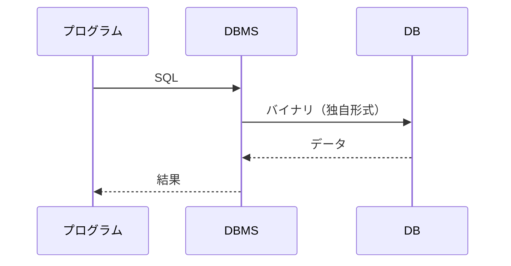

# DBMS

## 概要
データベース（DB）を安全・便利に操作するための管理システム。

## 理解したこと

### DB と DBMS の関係

| 用語 | 意味 | 比喩 |
|------|------|------|
| DB | データそのもの、またはデータの集まり | 倉庫 |
| DBMS | DBを安全・便利に操作するシステム | 管理人 |

### アクセスの流れ

SQLが登場するのは「プログラム ⇔ DBMS」間のみ。DBMSとDBの間はバイナリレベルのやり取り。

### DBMSが必要な3つの理由

| # | 理由 | 内容 |
|---|------|------|
| 1 | 同時アクセスの衝突防止 | 複数人が同時に同じデータを編集すると、後から保存した内容で上書きされてしまう |
| 2 | データの整合性保証（トランザクション） | 「送金側の残高は減ったが受取側に入金されなかった」などの中途半端な状態を防ぐ |
| 3 | セキュリティ・速度の提供 | インデックスによる高速検索、アクセス権によるセキュリティ管理 |

### DBMSの種類

| 種類 | 対応モデル | 代表製品 |
|---|---|---|
| RDBMS | リレーショナルDB | MySQL, PostgreSQL, Oracle |
| NoSQL DBMS | ドキュメント型・グラフ型など | MongoDB |

DBMSはRDBに限らず、すべてのDBモデルにそれぞれ対応したDBMSが存在する。

### トランザクションの歴史的背景

| | 経緯 |
|---|---|
| RDB | データをバラバラの表に分割する構造上、複数テーブルをまたぐ操作の整合性が命だったため最初から搭載 |
| ドキュメント型（NoSQL） | 当初はスピード重視でトランザクションを省略。現代のDBMSでは後から搭載された |

## 関連概念
- transaction
- sql
- db_design

## ソース
- 2026-05-20：達人DB 第1章

## タグ
DB, DBMS, SQL, トランザクション, インデックス, データベース設計
