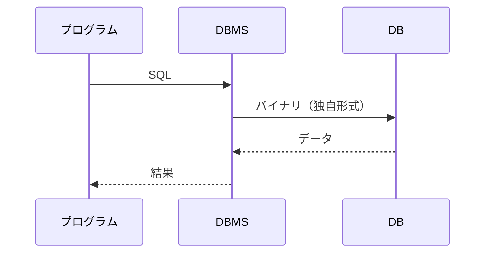

# DBMS

## 概要
データベース（DB）を安全・便利に操作するための管理システム。

## 理解したこと

### DB と DBMS の関係

| 用語 | 意味 | 比喩 |
|------|------|------|
| DB | データそのもの、またはデータの集まり | 倉庫 |
| DBMS | DBを安全・便利に操作するシステム | 管理人 |

### アクセスの流れ

```mermaid
sequenceDiagram
    プログラム->>DBMS: SQL
    DBMS->>DB: バイナリ（独自形式）
    DB-->>DBMS: データ
    DBMS-->>プログラム: 結果
```

SQLが登場するのは「プログラム ⇔ DBMS」間のみ。DBMSとDBの間はバイナリレベルのやり取り。

### DBMSが必要な3つの理由

| # | 理由 | 内容 |
|---|------|------|
| 1 | 同時アクセスの衝突防止 | 複数人が同時に同じデータを編集すると、後から保存した内容で上書きされてしまう |
| 2 | データの整合性保証（トランザクション） | 「送金側の残高は減ったが受取側に入金されなかった」などの中途半端な状態を防ぐ |
| 3 | セキュリティ・速度の提供 | インデックスによる高速検索、アクセス権によるセキュリティ管理 |

### DBMSの種類

| 種類 | 対応モデル | 代表製品 |
|---|---|---|
| RDBMS | リレーショナルDB | MySQL, PostgreSQL, Oracle |
| NoSQL DBMS | ドキュメント型・グラフ型など | MongoDB |

DBMSはRDBに限らず、すべてのDBモデルにそれぞれ対応したDBMSが存在する。

### トランザクションの歴史的背景

| | 経緯 |
|---|---|
| RDB | データをバラバラの表に分割する構造上、複数テーブルをまたぐ操作の整合性が命だったため最初から搭載 |
| ドキュメント型（NoSQL） | 当初はスピード重視でトランザクションを省略。現代のDBMSでは後から搭載された |

### ハードウェアのサイジング

DBサーバーのハードウェアを適切に選定するための見積もり。**キャパシティ**と**パフォーマンス**の2軸で考える。

#### キャパシティ（容量）

必要なストレージ容量の見積もり。以下2つの合算で算出する。

| 要素 | 内容 |
|---|---|
| 初期データ量 | テーブル・インデックス定義が確定しないと算出不可。画像・HTML等のファイル分も加算 |
| 運用終了時のデータ増加量 | サービス期間中の増加を見越しておかないと、途中でストレージ不足になる |

初期データ量の算出は**論理設計の完了が前提**。インデックスは設計次第で大きく増えるため、確定後でないと正確に見積もれない。

**データ増加量が読めない場合の3つのアプローチ**

| # | アプローチ | 内容 |
|---|---|---|
| 1 | 安全率を大きく取る | 余裕を持ったサイジングで設計段階で吸収 |
| 2 | 増設できる構成にする | オンプレミスで補助記憶装置を後から追加できるよう拡張余地を確保 |
| 3 | クラウドを利用する | ストレージ容量を運用しながら漸増できる |

#### パフォーマンス（性能要件）

性能要件は以下2つの指標で定義する。

| 指標 | 一言 | 定義 | 単位 |
|---|---|---|---|
| レスポンスタイム | どれだけ**早く**処理できるか | 特定の処理を何秒以内に完了するか | 秒 |
| スループット | どれだけ**たくさん**処理できるか | 単位時間あたりにどれだけの処理をこなせるか | TPS / QPS |

**TPS と QPS の違い**

| 指標 | 粒度 | 意味 |
|---|---|---|
| TPS（Transactions Per Second） | 業務の処理単位 | 1秒あたりのトランザクション数。システム全体で使われる汎用的な指標 |
| QPS（Queries Per Second） | SQLの実行単位 | 1秒あたりのクエリ数。DB特有の指標 |

レスポンスタイムとスループットは基本的に連動するが、バルク処理や限界負荷時には明確にトレードオフの関係になる（スループットを上げると1件あたりのレスポンスタイムが長くなる）。

## 関連概念
- transaction（トランザクションはDBMSが提供する整合性保証の中核）
- sql（プログラムとDBMSの間のやり取りに使われる言語）
- db_design（DBMSの選定・サイジングはDB設計の物理設計フェーズで行う）
- db_index（インデックスはDBMSが提供する高速検索機能の実体）

## ソース
- 2026-05-20：達人DB 第1章
- 2026-06-02：達人DB 第2章

## タグ
DB, DBMS, SQL, トランザクション, インデックス, データベース設計, サイジング, パフォーマンス, キャパシティ
