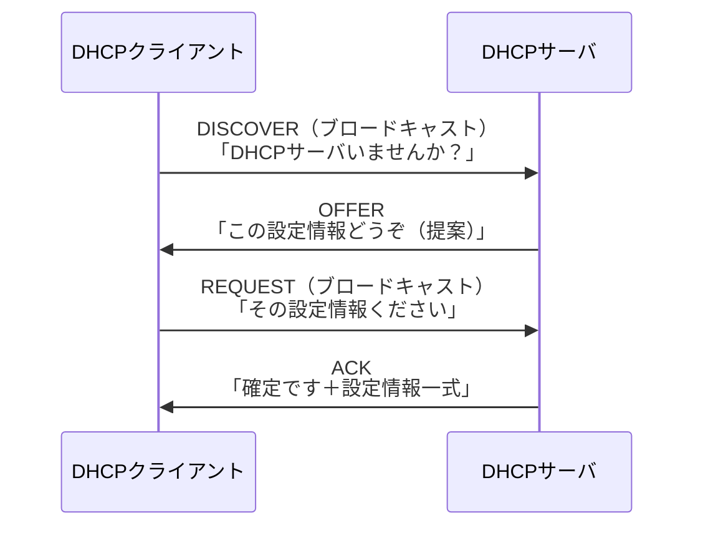

# DHCP（Dynamic Host Configuration Protocol）

## 概要
ネットワークに接続したコンピュータに対して、必要なネットワーク設定情報を自動的に配布するための仕組み。

## 理解したこと

### 構成要素
- **DHCPクライアント**：設定情報を受け取るコンピュータ側
- **DHCPサーバ**：設定情報を配布するネットワーク側。家庭用ルータには内蔵されていることが多い

### 配布される設定情報
- IPアドレス
- サブネットマスク
- デフォルトゲートウェイのIP
- DNSサーバのIP

### 動作の流れ（DORA）

#### REQUESTがブロードキャストな理由
ネットワーク内に複数のDHCPサーバがいる場合、選ばれなかったサーバに対して「あなたのOfferは使いません（待機しなくていい）」と一斉通知するため。

#### ACKに含まれる情報
確定した設定情報の一式が届く。
- IPアドレス・サブネットマスク・デフォルトゲートウェイのIP・DNSサーバのIP
- **リースタイム**：そのIPアドレスの貸出期限。期限が近づくと自動で延長リクエストが行われる

### アドレスプールとIPの割り当て
DHCPサーバはあらかじめ「この範囲を貸し出す」という**アドレスプール**を持っている（例：192.168.1.100〜200）。クライアントが来たらプールの中から未使用のIPを1つ選んで貸し出す。

- MACアドレスでクライアントを識別しており、同じクライアントにはできるだけ同じIPを割り当てようとする
- **DHCP予約**：「このMACアドレスには常にこのIPを割り当てる」と固定することも可能

### リースタイムがある理由
接続が切れたPCのIPをずっと確保し続けるとプールが枯渇するため。リース切れたIPは返却・再割り当て可能になる。使用中のクライアントは期限が近づくと自動で延長リクエストを送る。

### Dynamic（動的）の意味
DHCPのDはDynamic＝動的。リース切れ後の再接続で別のIPが割り当てられる可能性があり、IPアドレスは固定されない。

| | IPアドレス | 用途 |
|---|---|---|
| DHCP（動的） | 変わりうる | 一般クライアントPC・スマホなど |
| 静的IP（手動固定） | 変わらない | サーバ・ルータなど常に同じアドレスが必要なもの |

## 関連概念
- ip_address.md
- subnet.md
- routing.md
- domain_name.md

## ソース
- 2026-04-16：イラスト図解式ネットワークの基本 第3章

## タグ
DHCP, IPアドレス自動設定, リースタイム, DORA, ネットワーク, インフラ
