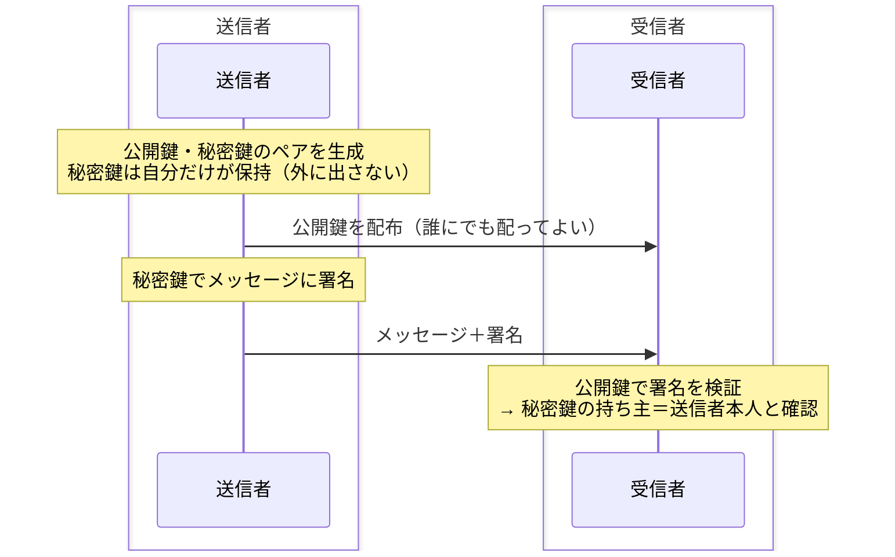

# デジタル署名

## 概要
秘密鍵で署名し公開鍵で検証することで、「送信者が本人であること」を証明する仕組み。

## 理解したこと

### フロー

### 証明のロジック
> 公開鍵で開けた → 秘密鍵で署名されたはず → 秘密鍵を持つのは送信者だけ → 送信者本人の証明

### 暗号化との本質的な違い

| | 目的 | 内容は見える？ |
|---|---|---|
| 暗号化 | 内容を隠す | 見えない |
| デジタル署名 | 送信者を証明する | **誰でも見える** |

操作としては秘密鍵で「ロック（暗号化）」している。ただし、そのロックを開ける公開鍵を全員に配っているため、誰でも開けられる＝内容は丸見えになる。「暗号化の操作はしているが、隠すという目的は果たせていない」状態。

ただし逆に、**公開鍵で開けられるロックをかけられるのは秘密鍵だけ**という性質を利用して、「この署名が開けられた＝秘密鍵の持ち主が作った」という本人証明に使う。隠すためではなく証明のために暗号化を使う、変化球的な活用法。

### 電子証明書との関係
電子証明書はCAがデジタル署名したドキュメント。内容は暗号化されておらず誰でも読める。
CAの秘密鍵による署名が付いていることで「この公開鍵は本物のサーバーのもの」と保証される。

## 関連概念
- pki.md
- encryption_methods.md
- ssl_tls.md

## ソース
- 書籍：イラスト図解式ネットワークの基礎　第6章（2026-05-15）
- https://shikaku-dou.com/fe-lesson-20/（2026-05-15）
- https://www.kagoya.jp/howto/it-glossary/security/ssl/（2026-05-15）

## タグ
デジタル署名, 公開鍵暗号, 本人証明, セキュリティ, PKI, 改ざん検出
