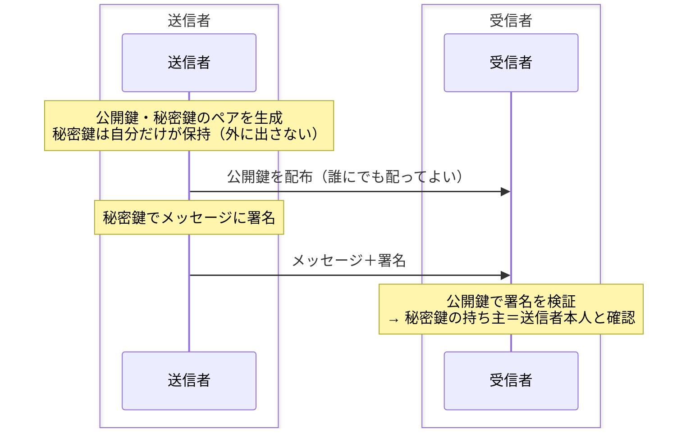

# デジタル署名

## 概要
秘密鍵で署名し公開鍵で検証することで、「送信者が本人であること」を証明する仕組み。

## 理解したこと

### フロー

```mermaid
sequenceDiagram
    box 送信者
        participant S as 送信者
    end
    box 受信者
        participant R as 受信者
    end

    Note over S: 公開鍵・秘密鍵のペアを生成<br/>秘密鍵は自分だけが保持（外に出さない）
    S->>R: 公開鍵を配布（誰にでも配ってよい）
    Note over S: 秘密鍵でメッセージに署名
    S->>R: メッセージ＋署名
    Note over R: 公開鍵で署名を検証<br/>→ 秘密鍵の持ち主＝送信者本人と確認
```

---

### 証明のロジック
> 公開鍵で開けた → 秘密鍵で署名されたはず → 秘密鍵を持つのは送信者だけ → 送信者本人の証明

---

### 暗号化との本質的な違い

| | 目的 | 内容は見える？ |
|---|---|---|
| 暗号化 | 内容を隠す | 見えない |
| デジタル署名 | 送信者を証明する | **誰でも見える** |

操作としては秘密鍵で「ロック（暗号化）」している。ただし、そのロックを開ける公開鍵を全員に配っているため、誰でも開けられる＝内容は丸見えになる。「暗号化の操作はしているが、隠すという目的は果たせていない」状態。

ただし逆に、**公開鍵で開けられるロックをかけられるのは秘密鍵だけ**という性質を利用して、「この署名が開けられた＝秘密鍵の持ち主が作った」という本人証明に使う。隠すためではなく証明のために暗号化を使う、変化球的な活用法。

---

### 署名の抽象契約（Sign/Verify関数）

署名の本質は、アルゴリズムに依存しない共通インターフェースとして捉えられる。

| 関数 | 入力 | 出力 |
|---|---|---|
| Sign | ハッシュ値, 秘密鍵 | 署名値 |
| Verify | ハッシュ値, 署名値, 公開鍵 | 真 or 偽 |

「秘密鍵でハッシュ値を暗号化する」という説明は、この`Sign`関数をRSAが実装するときにたまたま暗号化と同じ数式を流用しているだけであり、署名という概念そのものの定義ではない。

| | Signの中身 | Verifyの中身 |
|---|---|---|
| RSA | ハッシュ値に秘密鍵で指数演算（暗号化と同じ数式） | 署名値に公開鍵で指数演算 → ハッシュ値を復元して比較（復号と同じ数式） |
| ECDSA/DSA | 乱数＋秘密鍵＋ハッシュ値から`(r, s)`を計算 | 楕円曲線上の等式が成り立つか直接判定（復号という概念自体が存在しない） |

パスキー（WebAuthn）が主に使うのはECDSA/Ed25519であり、「暗号化」のイメージを持ち込むと実装の理解を誤る。

---

### 電子証明書との関係
電子証明書は、この署名の仕組みをCAが使った実例。証明書の中身・CAによる信頼チェーンの詳細は [pki.md](pki.md) を参照。

## 関連概念
- [pki.md](pki.md)（電子証明書という形でデジタル署名を実利用する仕組み）
- [encryption_methods.md](encryption_methods.md)（同じ鍵ペアを暗号化に使う場合との対比）
- [ssl_tls.md](ssl_tls.md)（証明書の検証にデジタル署名の仕組みが使われる）
- [passkey.md](passkey.md)（ECDSA/Ed25519による署名を実際に使う認証方式）
- [ecdsa_dsa.md](ecdsa_dsa.md)（Sign/Verify抽象契約の具体的な実装。署名・検証のフローの詳細はこちら）

## 関連実装
- [passkey_webauthn](../coding/passkey_webauthn/) — 実際の署名データ（clientDataJSON・signature）を見て、暗号化ではなく署名であることを確認した

## ソース
- 書籍：イラスト図解式ネットワークの基礎　第6章（2026-05-15）
- https://shikaku-dou.com/fe-lesson-20/（2026-05-15）
- https://www.kagoya.jp/howto/it-glossary/security/ssl/（2026-05-15）
- 2026-09-01・Qiita「デジタル署名アルゴリズム(DSA/ECDSA)」 https://qiita.com/lemiyachi/items/628576b16e8f490de17c

## タグ
デジタル署名, 公開鍵暗号, 本人証明, セキュリティ, PKI, 改ざん検出, ECDSA, RSA, Sign/Verify
