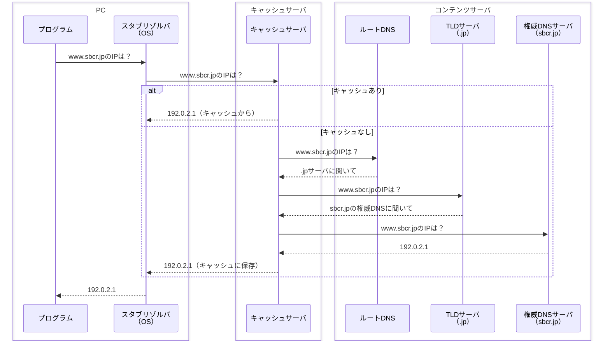

# DNS（Domain Name System）

## 概要
ドメイン名とIPアドレスを相互に変換（名前解決）するための分散型データベースシステム。

## 理解したこと

### なぜDNSが必要か
- IPアドレスは数値の羅列で人間には覚えにくい
- サーバ移行等でIPアドレスが変わることがある
- ドメイン名を固定の名前として使えば、裏側のIPアドレスが変わってもユーザーは影響を受けない

### 名前解決の流れ

### DNSサーバの2種類
| 種類 | 役割 |
|------|------|
| キャッシュサーバ（＝フルサービスリゾルバ） | クライアントからの問い合わせを受け、コンテンツサーバに代わりに聞きに行く。結果をキャッシュする |
| コンテンツサーバ | 実際のゾーンデータを持つ。ルートDNS・TLDサーバ・権威DNSサーバの総称 |

### コンテンツサーバにおける階層構造と分散処理
各サーバは「自分の担当範囲の答え」か「次に聞くべき場所」しか知らない。

| 階層 | 担当サーバ | 返す情報 |
|------|----------|---------|
| ルート（.） | ルートサーバ | 「.jpのことはTLDサーバへ」 |
| 第1レベル（.jp） | TLDサーバ | 「sbcr.jpのことは権威DNSへ」 |
| 第2レベル（sbcr.jp） | 権威DNSサーバ | 「www.sbcr.jpのIPは192.0.2.1」 |

ルートサーバへの負荷が集中しない理由：
- ほとんどの問い合わせはキャッシュサーバで解決（ルートまで届かない）
- 世界中にコピー（スレーブ）が分散配置されている
- 返す情報が「次に聞く場所」だけなので処理が極めて速い

### キャッシュサーバの可用性と冗長性

**キャッシュが「大体ある」理由**
- 多くのユーザが同じドメインを繰り返し問い合わせるため、コンテンツサーバからの回答が蓄積されている
- TTLが切れても別のユーザが同じドメインを再問い合わせしてキャッシュが更新され続けるため、人気ドメインは常にキャッシュが維持される

**1台が落ちても問題ない理由**
- キャッシュサーバは世界中に無数に存在し、それぞれが独立して動いている（協調しているのではなく、分散して冗長化されている）
- 1台のダウンは直下のユーザに一時的な影響を与えるが、OSのDNS設定を別のキャッシュサーバに切り替えることですぐ復旧できる

### TTL（Time To Live）
コンテンツサーバがキャッシュの有効期間を秒単位で指定する値。

- TTL長い → 効率的だが、IPアドレス変更の反映が遅れる
- TTL短い → 変更がすぐ反映される代わりに問い合わせ頻度が増える
- サーバ移行前にTTLを短く設定しておくのが運用上の定石

### ゾーン転送
マスター（プライマリ）DNSサーバからスレーブ（セカンダリ）DNSサーバへゾーンデータをコピーする作業。

| 用途 | プロトコル | ポート |
|------|----------|--------|
| 通常の名前解決 | UDP | 53 |
| ゾーン転送（バックアップ） | TCP | 53 |

TCPを使う理由：データの欠損が許されないため、信頼性の高いTCPを選択。

## 関連概念
- domain_name.md
- transport_layer.md
- application_layer_protocols.md
- network_identifiers.md
- dhcp.md

## ソース
- 2026-05-09：イラスト図解式ネットワークの基本 第5章

## タグ
DNS, 名前解決, キャッシュサーバ, コンテンツサーバ, TTL, ゾーン転送, ルートDNS, 分散処理, ネットワーク
