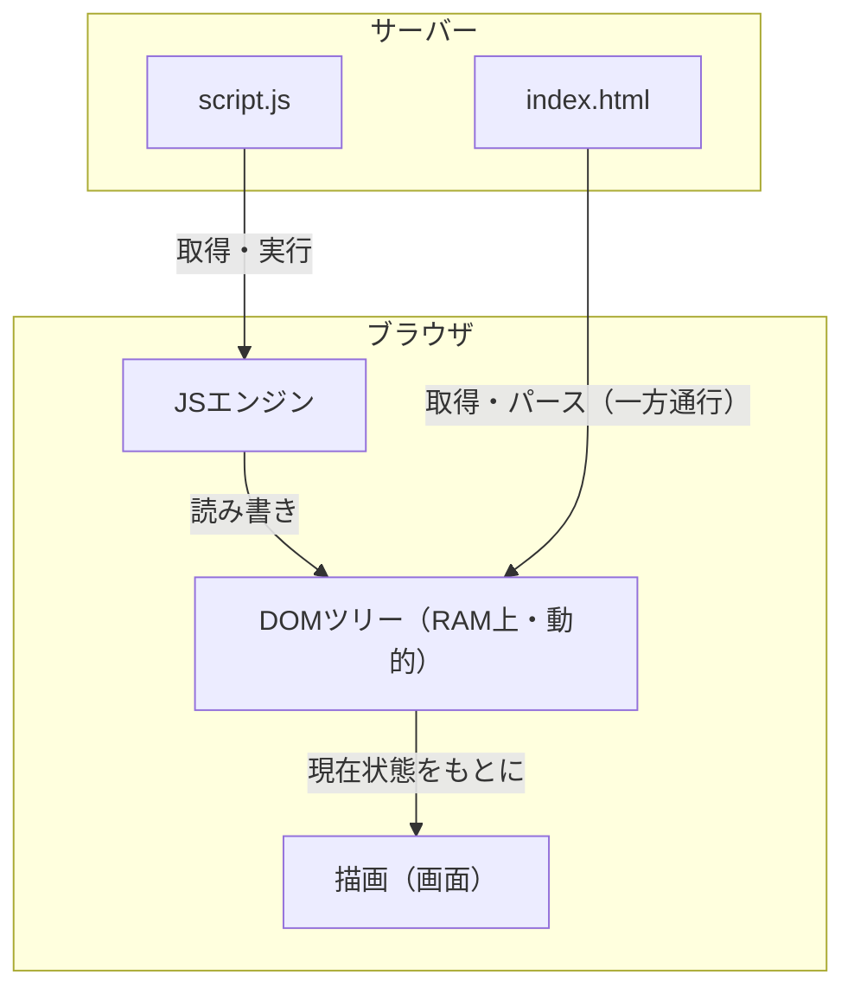

# DOM

## 概要
ブラウザがHTMLを読み込んで構築するオブジェクトのツリー、およびそれを操作するためのAPI。

## 理解したこと

### DOMとJavaScriptの関係

DOMはJavaScriptではなく、ブラウザが実装するWeb API。

JavaScriptがDOMを**使う**、という関係。

| | 役割 |
|---|---|
| DOM | ブラウザが実装するAPI。HTMLをオブジェクトツリーとして持つ |
| JavaScript | DOMのオブジェクトを読み書きする言語 |

---

### HTMLからDOMへの流れ

HTMLファイルは変わらない。DOMはブラウザのRAM上に展開される別物。



---

### リロードはDOMの作り直し

JSのDOM操作（`classList`の付け外し・`textContent`書き換え・`form.reset()`など）が変更するのは、ブラウザがメモリ上に持つDOMツリーだけ。HTMLファイル自体は書き換わらない。

リロードすると、ブラウザは今のDOMツリーを一旦捨てて、HTMLファイルを読み直して新しく作り直す。ファイルの内容は変わっていないので、JSで変更した状態は全部リセットされ、ファイルに書かれた初期状態に戻る。

---

### DOMツリー

タグひとつひとつが個別のオブジェクトになる。

```
<html>  → HTMLHtmlElement   { children: [body], parentElement: null }
  <body>  → HTMLBodyElement { children: [div],  parentElement: html }
    <div>   → HTMLDivElement { children: [p],   parentElement: body }
      <p>     → HTMLParagraphElement { textContent: "Hello", parentElement: div }
        "Hello" → Text { data: "Hello" }
```

タグの入れ子構造がそのままオブジェクトの親子関係になっている。

---

### 継承ツリー

全オブジェクトは `Node` を継承しているため、`parentElement` や `children` などの共通プロパティが全タグで使える。

```
Node（共通の基本機能）
├── Document  … Webページ全体・ツリーの根
├── Element   … <div>や<p>などのタグ
├── Attr      … href, src, class などの属性
└── Text      … 画面に映る生の文字
```

Elementはさらにタグごとに継承される：

```
Element → HTMLElement → HTMLParagraphElement（<p>）
                      → HTMLDivElement（<div>）
                      → HTMLAnchorElement（<a>）
```

---

### 継承ツリーとDOMツリーは別物

同じ「ツリー」という言葉でも、2つの全く異なる概念がある。

| | 継承ツリー | DOMツリー |
|---|---|---|
| 関係 | is-a（〜の一種） | has-a（〜を含む） |
| 意味 | 性質・機能の受け渡し | ページ上の入れ子構造 |
| 例 | Element は Node の一種 | `<body>` の中に `<p>` がある |
| HTMLと関係 | なし | そのまま対応 |

継承ツリーはクラス設計の話。DOMツリーはHTMLの構造の話。次元が違う。

---

### DocumentとElementの関係

`document` がDOMツリー全体の根っこであり入口。

```
Document（ツリー全体の根）
  └─ html（Element）
       └─ body（Element）
            └─ p（Element）
                 ├─ class="note"（Attr）
                 └─ "Hello"（Text）
```

| 関係の種類 | 具体例 |
|---|---|
| 継承（is-a） | HTMLParagraphElement は Element である |
| 包含（has-a） | Document は DOMツリーを**持っている** |

`document.querySelector('p')` はDocumentを起点にツリーを辿って探す。

---

### DOM操作の起点はElementが基本

現代のDOM操作はElementを起点にするのが基本で、AttrノードをDOM APIで直接触ることはほぼない。

| アプローチ | コード例 | 使われ方 |
|---|---|---|
| Attrノードを直接触る | `element.attributes[0]` | 古い・ほぼ使わない |
| Elementのメソッド経由 | `element.getAttribute('href')` | 現代の主流 |
| Elementのプロパティ経由 | `element.id`, `element.className` | 現代の主流 |

流れとしては「Documentを起点にElementを探し、そのプロパティでAttrの値を読む」。AttrはElementにくっついているものとして扱う。

---

### プロトタイプチェーンとの接点

DOMの継承ツリーはJavaScriptのプロトタイプチェーンとして公開される。

```javascript
const p = document.querySelector('p')
p instanceof HTMLParagraphElement  // true
p instanceof Node                  // true

// p → HTMLParagraphElement.prototype → HTMLElement.prototype
//   → Element.prototype → Node.prototype → Object.prototype
```

ページ上にタグが大量に存在しても、メソッドはプロトタイプに1つだけ存在し全インスタンスが参照する。

prototype_oop のメモリ効率がDOMで実際に効いている場面。

---

### イベントリスナーは「登録」、実行は後

`addEventListener`が行うのは「この種類のイベントが起きたら、この関数を呼ぶ」という登録だけで、渡した関数（コールバック）はその場では実行されない。

登録した瞬間に全部実行され終わる「準備コード」と、実際にイベントが起きた時だけ呼ばれる「コールバック」は別の層にある。登録したリスナーは、準備コードの実行が終わった後もブラウザが裏で待ち続け、実際にイベントが起きた瞬間だけ対応する関数が呼び出される（イベント駆動）。

```js
form.querySelectorAll('input').forEach((field) => {
  field.addEventListener('invalid', (event) => {
    // ← ここは登録した瞬間には実行されない。invalidイベントが起きた時だけ呼ばれる
  });
});
```

「関数を渡す」という見た目が同じでも、いつ呼ばれるかは渡した先の関数の仕様で決まる。

| | いつ呼ばれるか |
|---|---|
| `.forEach()`のコールバック | その行の実行中に要素数分、同期的に・即座に呼ばれる |
| `addEventListener`のコールバック | 実際にイベントが起きるまで呼ばれない（イベント駆動） |

なお`.forEach()`はJSの言語構文ではなく配列のメソッド呼び出し。C#の`foreach`（言語構文）に直接対応するのはJSの`for...of`であり、`.forEach()`の中では`break`が使えない。

---

## 関連概念
- prototype_oop（DOMノードがメソッドを共有する仕組み。大量のタグでもメモリ効率的な理由）
- javascript_language_design（プロトタイプベースOOPの歴史的経緯。なぜJSがDOMの操作言語になったか）

## 関連実装
- [booking_site_vanilla_js](../coding/booking_site_vanilla_js/) — classList操作・addEventListenerの実例、リロードでDOMが作り直される確認

## ソース
- 2026-06-10：会話ベースの整理
- 2026-06-22：/codeセッションでの実装・対話から追加（リロード・イベントリスナーの節）

## タグ
DOM, JavaScript, Web API, Node, Element, Document, プロトタイプ, ブラウザ, イベント駆動
