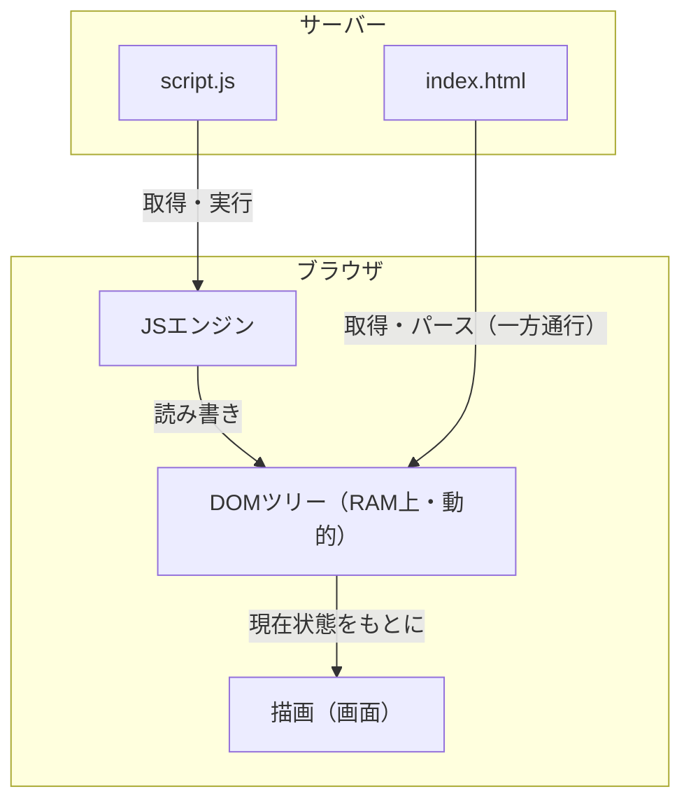

# DOM

## 概要
ブラウザがHTMLを読み込んで構築するオブジェクトのツリー、およびそれを操作するためのAPI。

## 理解したこと

### DOMとJavaScriptの関係

DOMはJavaScriptではなく、ブラウザが実装するWeb API。

JavaScriptがDOMを**使う**、という関係。

| | 役割 |
|---|---|
| DOM | ブラウザが実装するAPI。HTMLをオブジェクトツリーとして持つ |
| JavaScript | DOMのオブジェクトを読み書きする言語 |

---

### HTMLからDOMへの流れ

HTMLファイルは変わらない。DOMはブラウザのRAM上に展開される別物。



---

### DOMツリー

タグひとつひとつが個別のオブジェクトになる。

```
<html>  → HTMLHtmlElement   { children: [body], parentElement: null }
  <body>  → HTMLBodyElement { children: [div],  parentElement: html }
    <div>   → HTMLDivElement { children: [p],   parentElement: body }
      <p>     → HTMLParagraphElement { textContent: "Hello", parentElement: div }
        "Hello" → Text { data: "Hello" }
```

タグの入れ子構造がそのままオブジェクトの親子関係になっている。

---

### 継承ツリー

全オブジェクトは `Node` を継承しているため、`parentElement` や `children` などの共通プロパティが全タグで使える。

```
Node（共通の基本機能）
├── Document  … Webページ全体・ツリーの根
├── Element   … <div>や<p>などのタグ
├── Attr      … href, src, class などの属性
└── Text      … 画面に映る生の文字
```

Elementはさらにタグごとに継承される：

```
Element → HTMLElement → HTMLParagraphElement（<p>）
                      → HTMLDivElement（<div>）
                      → HTMLAnchorElement（<a>）
```

---

### 継承ツリーとDOMツリーは別物

同じ「ツリー」という言葉でも、2つの全く異なる概念がある。

| | 継承ツリー | DOMツリー |
|---|---|---|
| 関係 | is-a（〜の一種） | has-a（〜を含む） |
| 意味 | 性質・機能の受け渡し | ページ上の入れ子構造 |
| 例 | Element は Node の一種 | `<body>` の中に `<p>` がある |
| HTMLと関係 | なし | そのまま対応 |

継承ツリーはクラス設計の話。DOMツリーはHTMLの構造の話。次元が違う。

---

### DocumentとElementの関係

`document` がDOMツリー全体の根っこであり入口。

```
Document（ツリー全体の根）
  └─ html（Element）
       └─ body（Element）
            └─ p（Element）
                 ├─ class="note"（Attr）
                 └─ "Hello"（Text）
```

| 関係の種類 | 具体例 |
|---|---|
| 継承（is-a） | HTMLParagraphElement は Element である |
| 包含（has-a） | Document は DOMツリーを**持っている** |

`document.querySelector('p')` はDocumentを起点にツリーを辿って探す。

---

### プロトタイプチェーンとの接点

DOMの継承階層はJavaScriptのプロトタイプチェーンとして公開される。

```javascript
const p = document.querySelector('p')
p instanceof HTMLParagraphElement  // true
p instanceof Node                  // true

// p → HTMLParagraphElement.prototype → HTMLElement.prototype
//   → Element.prototype → Node.prototype → Object.prototype
```

ページ上にタグが大量に存在しても、メソッドはプロトタイプに1つだけ存在し全インスタンスが参照する。

prototype_oop のメモリ効率がDOMで実際に効いている場面。

---

## 関連概念
- prototype_oop（DOMノードがメソッドを共有する仕組み。大量のタグでもメモリ効率的な理由）
- javascript_language_design（プロトタイプベースOOPの歴史的経緯。なぜJSがDOMの操作言語になったか）

## ソース
- 2026-06-10：会話ベースの整理

## タグ
DOM, JavaScript, Web API, Node, Element, Document, プロトタイプ, ブラウザ
