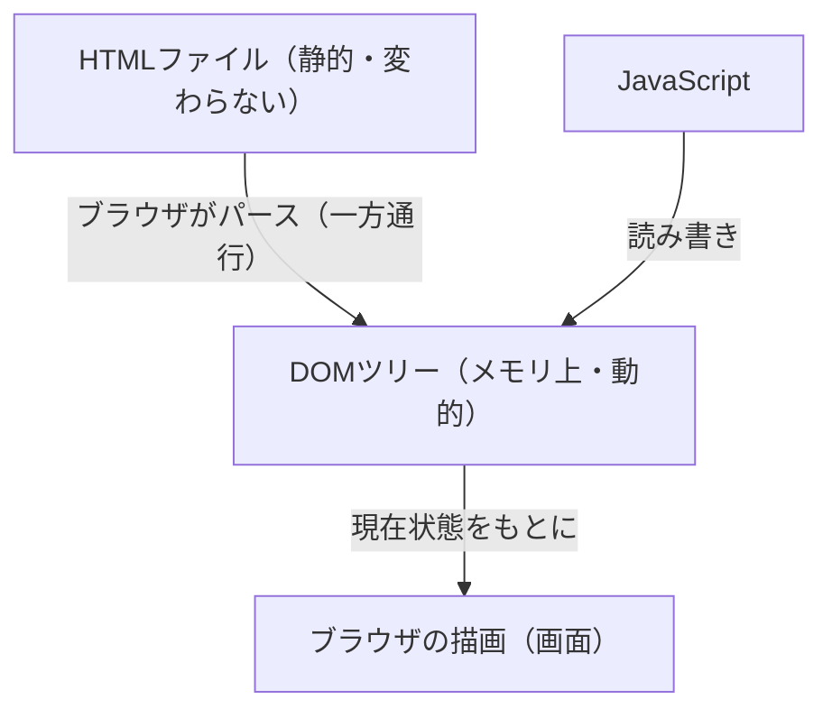

# DOM

## 概要
ブラウザがHTMLを読み込んで構築するオブジェクトのツリー、およびそれを操作するためのAPI。

## 理解したこと

### DOMとJavaScriptの関係

DOMはJavaScriptではなく、ブラウザが実装するWeb API。

JavaScriptがDOMを**使う**、という関係。

| | 役割 |
|---|---|
| DOM | ブラウザが実装するAPI。HTMLをオブジェクトツリーとして持つ |
| JavaScript | DOMのオブジェクトを読み書きする言語 |

---

### HTMLからDOMへの流れ

HTMLファイルは変わらない。DOMはメモリ上の別物。



---

### オブジェクトのツリー

タグひとつひとつが個別のオブジェクトになる。

```
<html>  → HTMLHtmlElement   { children: [body], parentElement: null }
  <body>  → HTMLBodyElement { children: [div],  parentElement: html }
    <div>   → HTMLDivElement { children: [p],   parentElement: body }
      <p>     → HTMLParagraphElement { textContent: "Hello", parentElement: div }
        "Hello" → Text { data: "Hello" }
```

タグの入れ子構造がそのままオブジェクトの親子関係になっている。

---

### Node継承階層

全オブジェクトは `Node` を継承しているため、`parentElement` や `children` などの共通プロパティが全タグで使える。

```
Node（共通の基本機能）
├── Document  … Webページ全体・ツリーの根
├── Element   … <div>や<p>などのタグ
├── Attr      … href, src, class などの属性
└── Text      … 画面に映る生の文字
```

Elementはさらにタグごとに継承される：

```
Element → HTMLElement → HTMLParagraphElement（<p>）
                      → HTMLDivElement（<div>）
                      → HTMLAnchorElement（<a>）
```

---

### DocumentとElementの関係

`document` がツリー全体の根っこであり入口。

| 関係の種類 | 具体例 |
|---|---|
| 継承（is-a） | HTMLParagraphElement は Element である |
| 包含（has-a） | Document は Elementツリーを**持っている** |

`document.querySelector('p')` はDocumentを起点にツリーを辿って探す。

---

### プロトタイプチェーンとの接点

DOMの継承階層はJavaScriptのプロトタイプチェーンとして公開される。

```javascript
const p = document.querySelector('p')
p instanceof HTMLParagraphElement  // true
p instanceof Node                  // true

// p → HTMLParagraphElement.prototype → HTMLElement.prototype
//   → Element.prototype → Node.prototype → Object.prototype
```

ページ上にタグが大量に存在しても、メソッドはプロトタイプに1つだけ存在し全インスタンスが参照する。

prototype_oop のメモリ効率がDOMで実際に効いている場面。

---

## 関連概念
- prototype_oop（DOMノードがメソッドを共有する仕組み。大量のタグでもメモリ効率的な理由）
- javascript_language_design（プロトタイプベースOOPの歴史的経緯。なぜJSがDOMの操作言語になったか）

## ソース
- 2026-06-10：会話ベースの整理

## タグ
DOM, JavaScript, Web API, Node, Element, Document, プロトタイプ, ブラウザ
