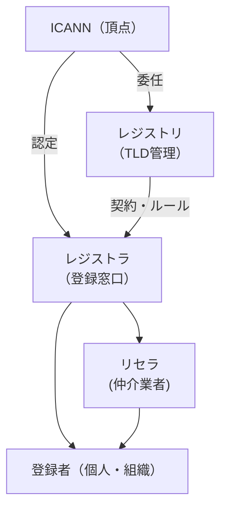

# ドメイン名とDNS管理体系

## 概要
インターネット上のIPアドレスを人間が読みやすい名前（ドメイン名）で管理する仕組みと、その管理体制。

## 理解したこと

### ドメイン名の管理体系

### 各役割

| 組織 | 役割 |
|------|------|
| ICANN | インターネット全体のドメイン名・IPアドレス管理の調整機関 |
| レジストリ | TLDごとの管理組織。ICANNから委任される（例：`.com` → Verisign） |
| レジストラ | ドメイン登録の窓口組織。ICANNから認定を受け、レジストリと契約して運営 |
| リセラ | レジストラの下でドメインを再販する事業者 |
| 登録者 | 実際にドメインを使う個人・組織 |

### ポイント
- ICANNは「管理（レジストリ委任）」と「販売（レジストラ認定）」を別枠で管理している
- レジストラはレジストリが定めるルールに則ってドメインを販売する
- TLDには国別（`.jp`, `.us`）と分野別（`.com`, `.org`）がある

## 関連概念
- ip_address.md
- application_layer_protocols.md
- network_identifiers.md

## ソース
- 2026-04-12：イラスト図解式ネットワークの基本 第3章

## タグ
ドメイン名, DNS, ICANN, レジストリ, レジストラ, TLD, ネットワーク, インフラ
