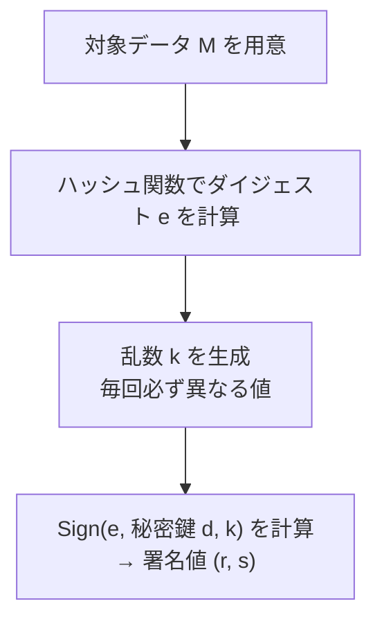

# ECDSA / DSA

## 概要
公開鍵暗号の「暗号化・復号」とは別系統の、署名専用のアルゴリズム。乱数を使った専用の数式でSign/Verifyを実現する。[digital_signature.md](digital_signature.md)で整理した「Sign/Verify抽象契約」の具体的な実装の1つ。

## 理解したこと

### 署名（Sign）のフロー



---

### 検証（Verify）のフロー

```mermaid
flowchart TD
    A[M と 署名値(r,s) と 公開鍵 Q を取得] --> B[Mからダイジェスト e を再計算]
    B --> C["Verify(e, (r,s), Q) を計算<br/>→ 真 or 偽"]
```

RSAの検証のように「署名を復号してeを取り出し比較する」のではなく、`(r, s)`と`e`と`Q`を使った等式が成り立つかを直接判定する。復号という操作自体が存在しない。

---

### DSAとECDSAの違い

| | 数学的な土台 | 特徴 |
|---|---|---|
| DSA | 有限体上の離散対数問題 | 同等の強度を得るには長い鍵長が必要 |
| ECDSA | 楕円曲線上の離散対数問題 | 短い鍵長で同等の強度（256bit ECDSA ≒ 3072bit RSA相当） |

WebAuthn/パスキーがECDSA（またはEd25519）を選ぶのは、この鍵長の短さによる処理・通信コストの低さが理由の一つ。

---

### 乱数kが漏れると何が起きるか

署名のたびに**必ず異なる**乱数`k`が必要という制約がある。同じ`k`を2回使ってしまうと、2つの署名`(r, s1)`と`(r, s2)`から連立方程式的に秘密鍵`d`を逆算できてしまう。

「乱数を使って安全性を作っている」のに、その乱数の生成が壊れていると秘密鍵が直接漏れる、という設計上の急所。ハードウェアの生体認証/PINが必須なパスキーの文脈では、乱数生成はSecure Enclave/TPM側の責任範囲になる。

## 関連概念
- [digital_signature.md](digital_signature.md)（Sign/Verifyという抽象契約。ECDSA/DSAはその具体的な実装の1つ）
- [encryption_methods.md](encryption_methods.md)（RSAの暗号化・復号との対比）
- [passkey.md](passkey.md)（WebAuthnで実際にECDSA/Ed25519が使われる認証方式）

## 関連実装
- [passkey_webauthn](../coding/passkey_webauthn/) — `pubKeyCredParams`でES256（ECDSA）が優先アルゴリズムとして指定されている実例

## ソース
- 2026-09-01・Qiita「デジタル署名アルゴリズム(DSA/ECDSA)」 https://qiita.com/lemiyachi/items/628576b16e8f490de17c

## タグ
デジタル署名, ECDSA, DSA, 楕円曲線暗号, 公開鍵暗号, セキュリティ, Sign/Verify, nonce
