# カプセル化と逆カプセル化

## 概要
TCP/IPの各層がヘッダを付加・除去しながらデータを転送する仕組み。送信側でカプセル化し、受信側で逆カプセル化することで、送りたいデータがそのまま相手に届く。

## 理解したこと

**送信側（カプセル化）：上位層 → 下位層へ降りるたびにヘッダが付加される**

1. アプリケーション層：送りたいデータ
2. トランスポート層：+ TCPヘッダ
3. インターネット層：+ IPヘッダ
4. ネットワークインターフェース層：+ イーサネットヘッダ・プリアンブル・FCS

**受信側（逆カプセル化）：下位層 → 上位層へ上がるたびにヘッダを読んで除去する**

4. ネットワークインターフェース層：イーサネットヘッダ・プリアンブル・FCS を除去
3. インターネット層：IPヘッダを除去
2. トランスポート層：TCPヘッダを除去
1. アプリケーション層：元のデータが届く

- プリアンブル：データ開始を示すマーク（イーサネット固有）
- FCS（フレームチェックシーケンス）：誤り検出用データ（イーサネット固有）
- 最終的にAのアプリで発生したデータと同じものがBのアプリに届く

## 構成図

```mermaid
graph LR
    subgraph A["コンピュータ A（送信側）"]
        A1["<b>アプリケーション層</b><br/>データ"]
        A2["<b>トランスポート層</b><br/>TCPヘッダ ＋ データ"]
        A3["<b>インターネット層</b><br/>IPヘッダ ＋ TCPヘッダ ＋ データ"]
        A4["<b>ネットワークI/F層</b><br/>Etherヘッダ ＋ IPヘッダ ＋ TCPヘッダ ＋ データ ＋ FCS"]
        A1 -->|"TCPヘッダ付加"| A2
        A2 -->|"IPヘッダ付加"| A3
        A3 -->|"Etherヘッダ・プリアンブル・FCS付加"| A4
    end

    A4 -->|"イーサネットで送信"| B4

    subgraph B["コンピュータ B（受信側）"]
        B4["<b>ネットワークI/F層</b><br/>Etherヘッダ ＋ IPヘッダ ＋ TCPヘッダ ＋ データ ＋ FCS"]
        B3["<b>インターネット層</b><br/>IPヘッダ ＋ TCPヘッダ ＋ データ"]
        B2["<b>トランスポート層</b><br/>TCPヘッダ ＋ データ"]
        B1["<b>アプリケーション層</b><br/>データ"]
        B4 -->|"Etherヘッダ・FCS除去"| B3
        B3 -->|"IPヘッダ除去"| B2
        B2 -->|"TCPヘッダ除去"| B1
    end
```

<!-- イラスト図解式ネットワークの基本 第2章 / 2026-04-01 -->

## 関連概念
- tcp_ip_model
- transport_layer
- packet_and_switching
- layered_architecture
- ethernet_frame.md（イーサネット層でのカプセル化の具体例。フレーム構造とMACアドレスのホップごとの書き換えも含む）

## ソース
- 2026-04-01：イラスト図解式ネットワークの基本 第2章

## タグ
カプセル化, TCP/IP, イーサネット, ヘッダ, ネットワーク, パケット
