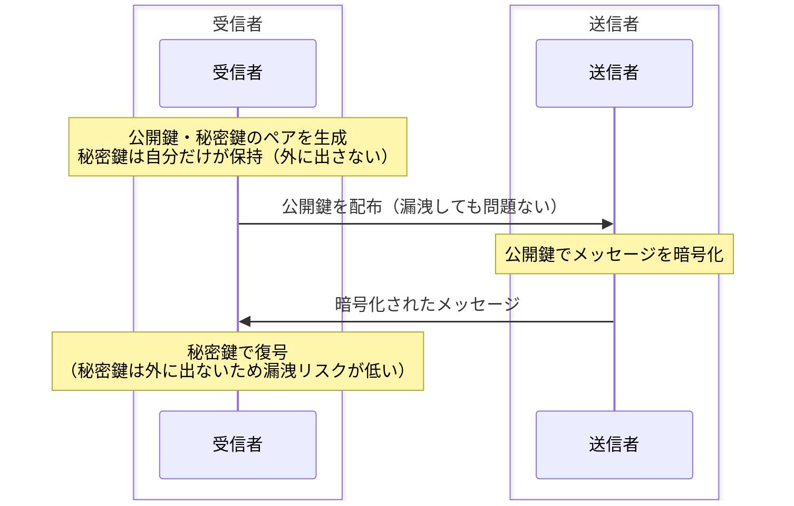

# 暗号化方式

## 概要
データを安全に伝送するための暗号化技術。共通鍵・公開鍵・ハイブリッドの3種類が実用される。

## 理解したこと

### 共通鍵暗号方式
- 暗号化と復号に同じ鍵を使う
- 高速で処理コストが低い
- **鍵配送問題**：相手に鍵を渡す経路が安全でなければ意味がない。この問題を解決するために公開鍵暗号方式が生まれた
- 代表例：AES、DES

### 公開鍵暗号方式

**数学的な原則：**  
数学的に対になる2つの鍵（A・B）のペアを作る。
- 性質1：Aで閉じればBで開く
- 性質2：Bで閉じればAで開く

**名前の定義：**  
- 自分だけが持つ方 → 「秘密鍵」
- みんなに配る方 → 「公開鍵」

**用途による役割の変化：**
- 暗号化したいとき：全員が持つ「公開鍵」で閉じ、本人だけが「秘密鍵」で開ける
- 署名したいとき：本人だけが「秘密鍵」で閉じ、全員が「公開鍵」で開ける

秘密鍵を渡す必要がないため鍵配送問題を解決できる。ただし処理コストが高く遅い。  
代表例：RSA、ECDSA



### ハイブリッド暗号方式（実用）
公開鍵暗号の「遅さ」と共通鍵の「鍵配送問題」を両方解決するための組み合わせ。

```
① 公開鍵暗号で共通鍵を安全に交換（遅いが安全）
② 以降の通信は共通鍵で暗号化（速い）
```

HTTPSなどの実際の通信はほぼこの方式で動いている。

### 目的による鍵の使い方の違い
同じ鍵ペアでも目的によって使い方が逆になる：

| 目的 | 閉じる鍵 | 開ける鍵 |
|---|---|---|
| 暗号化（内容を隠す） | 公開鍵 | 秘密鍵（受信者だけが開ける） |
| デジタル署名（本人証明） | 秘密鍵 | 公開鍵（誰でも検証できる） |

## 関連概念
- digital_signature.md
- ssl_tls.md
- pki.md

## ソース
- 書籍：イラスト図解式ネットワークの基礎　第6章（2026-05-15）
- https://shikaku-dou.com/fe-lesson-20/（2026-05-15）
- https://www.kagoya.jp/howto/it-glossary/security/ssl/（2026-05-15）

## タグ
暗号化, 共通鍵, 公開鍵, RSA, ハイブリッド暗号, AES, 鍵配送問題, セキュリティ
