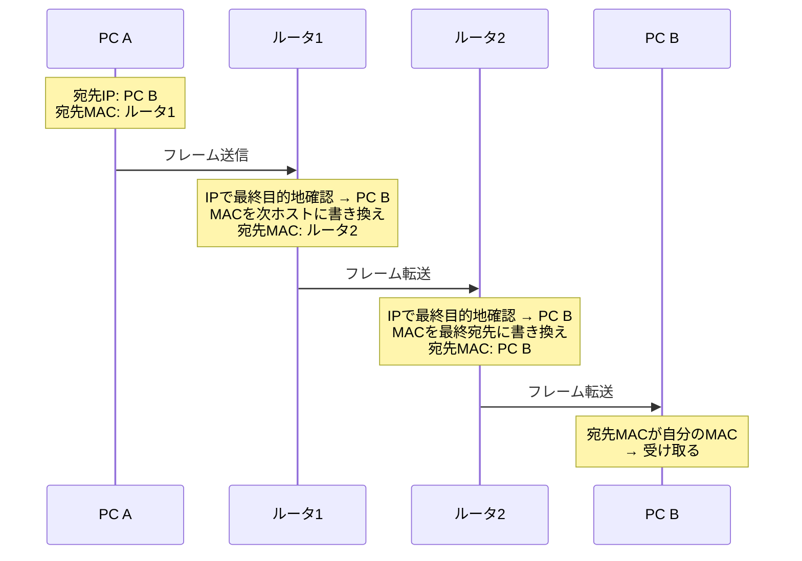

# イーサネットフレーム

## 概要
イーサネットがデータを送受信する際の単位。データを小分けにしてフレームという形で送り出す。

## 理解したこと

### フレームの構成

| フィールド | サイズ | 役割 |
|-----------|--------|------|
| プリアンブル | 8バイト | 送信開始のマーク（同期用） |
| 宛先MACアドレス | 6バイト | 次のホップの宛先 |
| 送信元MACアドレス | 6バイト | 送信元機器の識別子 |
| タイプ | 2バイト | データ部に含まれる上位プロトコルの種類（IP・ARPなど） |
| データ | 46〜1500バイト | 実際のデータ（パケット等を内包） |
| FCS | 4バイト | 誤り検出のためのチェックコード |

- データフィールドのみ可変長、他は固定サイズ
- 「開始の合図→宛先・送信元→データの種類→データ本体→チェックコード」という順番で受信側が処理しやすい設計

### MACアドレスとIPアドレスの役割分担
- **IPアドレス**：ブレない最終目的地（通信中ずっと変わらない）
- **MACアドレス（フレーム内）**：現在の1ホップの宛先（ルータを経由するたびに書き換えられる）

フレームのMACアドレスは「最終目的地」ではなく「次に渡す相手」が書かれている。ルータを通過するたびに宛先MACアドレスが次のルータのアドレスに書き換えられ、最終ルータで宛先端末のMACアドレスに書き換えて送信する。

### カプセル化との関係
フレームのデータ部分にはパケット（IPヘッダ＋TCPヘッダ＋データ）が入っている。カプセル化の考え方により、ネットワークインターフェース層はMACアドレス部分だけを見て転送判断する。

## 関連概念
- encapsulation.md
- mac_address.md
- ethernet.md

## ソース
- 2026-04-23：イラスト図解式ネットワークの基本 第4章

## タグ
イーサネット, フレーム, MACアドレス, FCS, プリアンブル, カプセル化, ネットワーク
