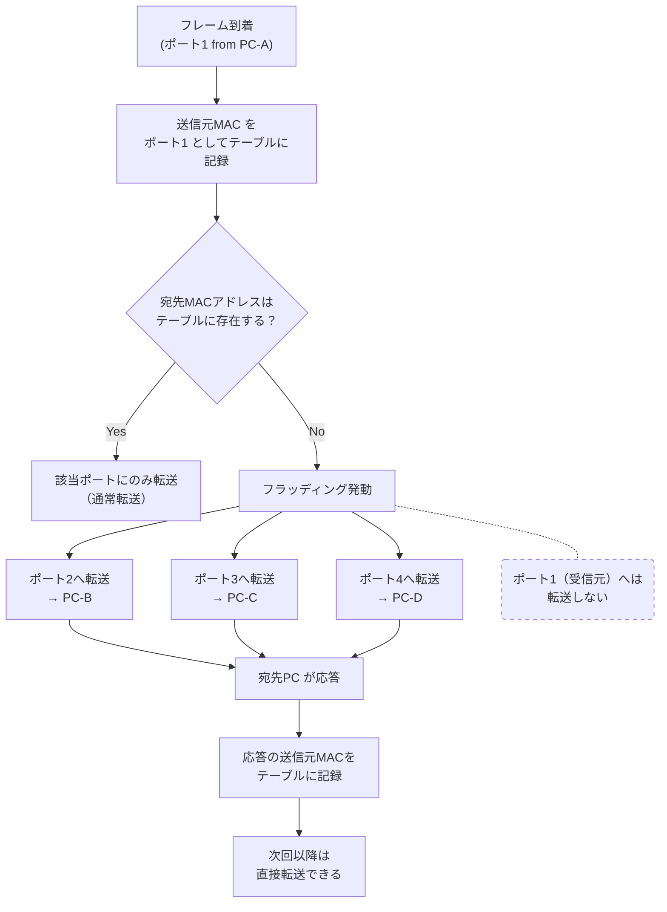

# フラッディング（Flooding）

## 概要
L2スイッチが宛先MACアドレスをテーブルで解決できないとき、受信ポートを除く全ポートにフレームを転送する仕組み。

## 理解したこと
- 宛先MACアドレスがMACアドレステーブルに存在しない場合に発動する
- フレームが届いたポート以外の全ポートにそのフレームを送出する
- 相手からの返信が来るとその送信元MACアドレスがテーブルに登録され、次回以降はフラッディング不要になる

### ブロードキャストとの違いと関係
- **ブロードキャスト**：「全員に届けたい」という意図を持つ通信方式（上位概念・論理的）
- **フラッディング**：ブロードキャストを物理的に実現するL2レベルの仕組み（下位概念・物理的）
- ブロードキャストフレームが届いたとき、L2スイッチはフラッディングによってそれを全ポートに転送する

### トラフィックへの影響
- 全ポートに転送するため、接続機器が多いほどトラフィックが増加する
- この問題はL3スイッチの導入によって軽減される

## フラッディングの流れ

<!-- 2026-04-24 -->

## 関連概念
- hub_and_switch.md
- mac_address.md
- network_communication_types.md

## ソース
- 2026-04-24・書籍「イラスト図解式ネットワークの基本」第4章

## タグ
ネットワーク, L2スイッチ, フラッディング, MACアドレステーブル, ブロードキャスト
