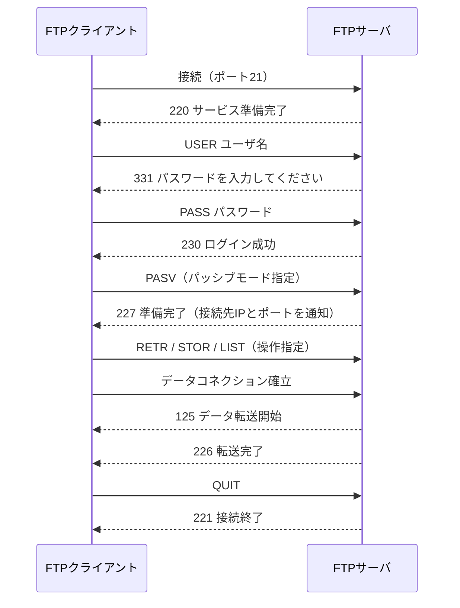

# FTP（File Transfer Protocol）

## 概要
ファイル転送・管理専用のプロトコル。HTTPのように「表示するため」ではなく「ファイルを整理・操作するため」の設計。転送だけでなくリモートでの削除・移動・名前変更も可能。

## 理解したこと

### HTTPとの違い
- HTTPは「ブラウザに表示するため」の設計 → 数個〜数十個のファイルを扱う規模感
- FTPは「ファイル管理のため」の設計 → 数千〜数万個を扱う規模感

### ポート
| ポート | 役割 |
|--------|------|
| 21番 | 制御コネクション（コマンド・応答のやり取り） |
| 20番 | データコネクション（実際のファイル転送） |

2ポート構成は歴史的経緯。当時は1ポートで制御とデータを同時に扱う技術がなく、大容量ファイル転送の中断などができなかったため制御専用チャンネルを別途用意した。

### アクティブモードとパッシブモード
| モード | 制御コネクション | データコネクション |
|--------|----------------|------------------|
| アクティブ | クライアント → サーバ | サーバ → クライアント |
| パッシブ | クライアント → サーバ | クライアント → サーバ |

現代のファイアウォールは「外部→内部」の通信を遮断するため、アクティブモードはデータコネクション確立時にファイアウォールに弾かれる。パッシブモードはサーバがポートを開けてからクライアントが接続しに行くため通過できる。**現代では実質パッシブモードのみ機能する。**

### 暗号化版
素のFTPは性善説時代の設計で平文通信（セキュリティ皆無）。現在は暗号化版が使われる。

| 名称 | 暗号化技術 |
|------|-----------|
| SFTP | SSH |
| FTPS | SSL/TLS |

### 典型的なFTPセッションの流れ

### レスポンスコード
先頭の数字が種別を示す。

| 先頭 | 意味 |
|------|------|
| 1xx | 処理開始（成功・継続中） |
| 2xx | 成功（完了） |
| 3xx | 追加情報が必要（成功・継続中） |
| 4xx | 一時エラー |
| 5xx | 恒久エラー |

## 関連概念
- application_layer_protocols
- ssl_tls
- ssh（次回学習予定）

## ソース
- 2026-05-06：イラスト図解式 ネットワークの基礎 第5章

## タグ
FTP, SFTP, FTPS, ファイル転送, アクティブモード, パッシブモード, ポート20, ポート21, アプリケーション層
