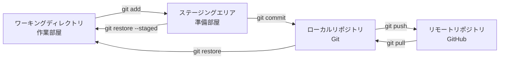

# Git

## 概要
ファイルの変更履歴をコミット単位で管理するバージョン管理ツール。ローカルで完結する仕組みであり、GitHub（リモート）と組み合わせてチーム開発に使う。

## 理解したこと

### Git と GitHub の違い

| | Git | GitHub |
|---|---|---|
| 種別 | ローカルで動くツール・仕組み | ネット上の保管サーバー（ウェブサービス） |
| 役割 | 変更履歴の管理 | リポジトリの共有・公開 |

### 変更が確定するまでの4段階フロー

### 逆方向の操作

| コマンド | 方向 | 用途 |
|---|---|---|
| `git pull` | GitHub → ローカル | 他人の変更を手元に取り込む（手元を最新にする） |
| `git restore` | ローカルリポジトリ → ワーキングディレクトリ | 作業中の変更を破棄して直前コミット状態に戻す |
| `git restore --staged` | ステージング → ワーキングディレクトリ | addを取り消してやり直す |

### ステージングエリアが存在する理由
addのたびにコミットメッセージを書くのは非効率。一時的にステージングエリアに集めておき、「意味のまとまり」単位でまとめてコミットできるようにするため。

### コミットの粒度

| | 問題点 |
|---|---|
| 小さすぎ（ファイル単位） | 関連変更がバラバラになり履歴が読みにくい |
| 大きすぎ（1日分まとめて） | revert時に無関係な変更まで巻き込まれる |
| ちょうどいい（目的単位） | 1文で説明できる・後から追いやすい |

基準：**「1つのメッセージで過不足なく説明できる単位」**

### 主要コマンド一覧

| コマンド | 説明 |
|---|---|
| `git init` | リポジトリを新規作成 |
| `git clone URL` | リモートを丸ごとコピーして手元に作る（初回のみ） |
| `git add ファイル名` | ステージングエリアに追加 |
| `git commit` | ステージングした変更をコミット |
| `git push` | コミットをGitHubにアップロード |
| `git pull` | GitHubから最新を取得 |
| `git status` | 各ファイルがどの段階にあるか確認 |
| `git log --oneline --graph` | コミット履歴をグラフ表示 |
| `git show コミットID` | コミットの詳細を表示 |
| `git diff ID1 ID2` | 2つのコミット間の差分を表示（`^`で1つ前、`HEAD`で現在） |
| `git checkout / git switch --detach` | 別のコミットに移動 |
| `git restore -s コミットID` | 特定ファイルを指定コミット時点に戻す |
| `git revert コミットID` | 逆のコミットを追加して打ち消す |
| `git tag タグ名 コミットID` | コミットに目印をつける |

### HEAD（現在地ポインタ）

HEAD は「自分が今いる場所」を指すポインタ。2つの状態がある。

| 状態 | HEADが指すもの | コミットしたとき |
|---|---|---|
| 通常 | ブランチ名 | ブランチが自動前進、HEADも追従 |
| detached HEAD | コミットID直接 | HEADだけが前進、ブランチは無関係 |

`git branch` の `*` がついている行が「HEADの現在地」。
detached 時は `* (HEAD detached at abc1234)` と表示される。

コンフリクトマーカーの `<<<<<<< HEAD` も同じ意味：「HEADが指す側（今いるブランチ）の変更内容」。

### コミットの構造

- 各コミットは一意のハッシュID（例：`e9f7a92`）を持つ
- 各コミットは「親コミットのID」を1つ保持しており、数珠繋ぎのツリー構造になっている
- ブランチは「最新コミットへのポインタ（付箋）」に過ぎない

### 日々の開発サイクル
1. `clone`（初回のみ）
2. ファイルを編集（ワーキングディレクトリ）
3. `add` → `commit`（手元に保存）
4. `push`（チームに共有）
5. `pull`（他人の変更を取り込む）
6. やらかしたら `restore`

## 関連概念
- pull_request
- ci_cd
- git_branch

## ソース
- 2026-05-17：MIXI25卒Git研修資料（https://www.youtube.com/watch?v=DTY3RBkXQBA&t=536s）

## タグ
git, バージョン管理, GitHub, commit, staging, pull, push, restore, revert, HEAD, detached HEAD
