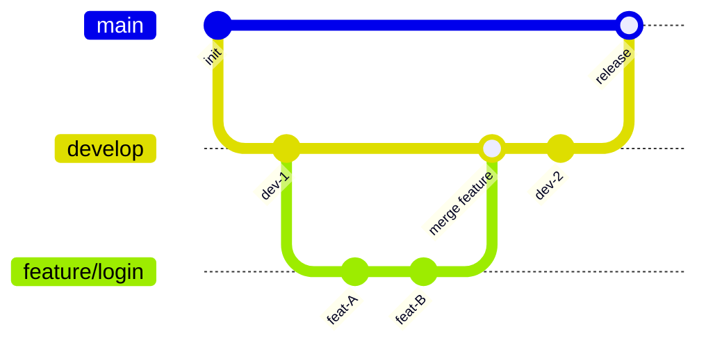
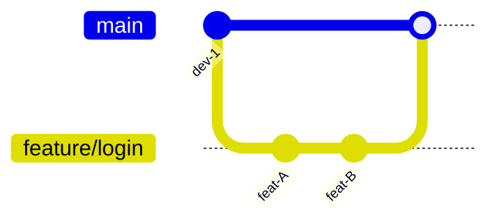
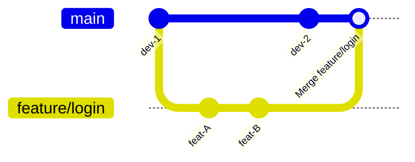
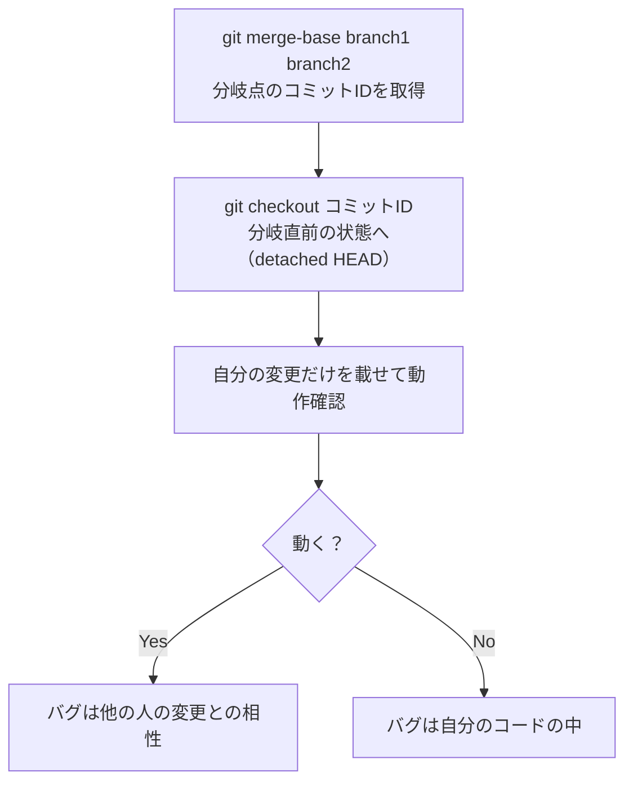

# Gitブランチ戦略とマージ

## 概要
複数の開発を並行して行うブランチ機能と、それらを合流させるマージの仕組み。

## 理解したこと

### ブランチの役割分担（典型的なGitFlow）

| ブランチ | 役割 | イメージ |
|---|---|---|
| main | 本番・リリース済みのコード | 本番のステージ（お客さんが見ている） |
| develop | 次回リリースの統合ブランチ | 楽屋・リハーサル室 |
| feature/〇〇 | 個人の機能開発 | 自分の作業机 |

鉄則：**ブランチは小さく作り、寿命を短くして、早くdevelopに合流させる。**



### 主要コマンド

| コマンド | 用途 |
|---|---|
| `git branch` | ブランチ一覧（`*`がHEADの現在地） |
| `git branch <ブランチ名>` | 新しいブランチを作成（移動はしない） |
| `git branch -d <ブランチ名>` | ブランチを削除 |
| `git checkout <ブランチ名>` | 指定ブランチに移動 |
| `git checkout -b <ブランチ名>` | 新ブランチを作成して移動 |
| `git checkout <コミットID>` | 特定のコミットに移動（detached HEAD状態になる） |
| `git merge <ブランチ名>` | 今いるブランチに指定ブランチの内容を取り込む |
| `git merge <ブランチ名> --no-ff` | マージコミットを強制して合流の痕跡を残す |
| `git merge <ブランチ名> --ff-only` | fast-forwardのみ許可（できなければ中止） |
| `git merge-base <ブランチ1> <ブランチ2>` | 2つのブランチの分岐点コミットIDを取得 |

### マージの種類：fast-forward vs --no-ff

| | fast-forward（デフォルト） | --no-ff（マージコミット強制） |
|---|---|---|
| 発生条件 | 相手だけがコミットしていた（分岐後、自分は何もしていない） | 両方がコミットしていた、または明示指定 |
| ログの見た目 | 直線（マージの痕跡なし） | `/` で膨らむ（ブランチの合流が見える） |
| コマンド | `git merge develop --ff-only` | `git merge develop --no-ff` |

**fast-forward（直線になる）**

→ 最初からmainに直接書き込んでいたように見える。

**--no-ff（合流の痕跡が残る）**

→ ブランチが存在していたこと・どこで合流したかが履歴に残る。

どちらを使うかはチームの文化による。

### コンフリクト（衝突）の解決

Git のマージは行単位で処理される。同じ行を複数ブランチが変更してマージしようとすると発生する。

```
<<<<<<< HEAD          ← 自分がいるブランチ（HEADの現在地）の変更
自分の変更内容
=======
相手の変更内容
>>>>>>> feature/login ← 取り込もうとしたブランチの変更
```

解決フロー：
1. `git status` でコンフリクトしているファイルを確認
2. ファイルを開いてマーカーを見て「あるべき姿」に編集・マーカーを削除
3. `git add ファイル名`（複数ある場合は1ファイルずつ）
4. 全部片付いたら `git commit`

### merge-base：分岐点の特定

`git merge-base branch1 branch2` で2つのブランチが分岐したコミットIDを取得できる。

デバッグ活用パターン：



**detached HEAD の使い方の原則**
- 確認・調査目的で `git checkout <コミットID>` するのはOK
- そこから本格的に作業するなら必ず `git checkout -b <ブランチ名>` でブランチを作ってから
- detached HEAD のまま作業して別ブランチに移動すると、積んだコミットへの参照がなくなって消える

### stash：未完成の作業を一時退避

作業中に別ブランチへの切り替えが必要になったとき、コミットせずに変更を退避できる。

| コマンド | 用途 |
|---|---|
| `git stash` | 現在の作業を退避 |
| `git stash list` | 退避一覧を表示 |
| `git stash apply stash@{番号}` | 指定した退避を復元（スタックは残る） |
| `git stash pop` | 最新の退避を復元して削除 |
| `git stash drop stash@{番号}` | 指定した退避を削除 |

`git worktree` という手段もあるが、同時並行作業が本当に必要なケース向け。基本的にstashで十分。

## 関連概念
- git

## ソース
- 2026-05-24：MIXI25卒Git研修資料（https://www.youtube.com/watch?v=DTY3RBkXQBA&t=868s）

## タグ
git, branch, merge, conflict, fast-forward, stash, HEAD, GitFlow
