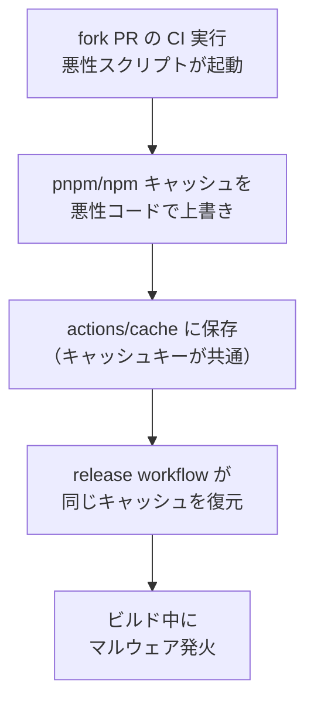

# GitHub Actions セキュリティ

## 概要
GitHub Actions の設計ミスや誤設定が、CI/CDパイプライン全体をサプライチェーン攻撃の踏み台にする。

## 理解したこと

### pull_request_target の危険性

| | `pull_request` | `pull_request_target` |
|--|--|--|
| fork PR の実行環境 | 隔離（本体と切り離し） | 本体の権限で実行 |
| secret へのアクセス | 不可（安全） | 可能（危険） |
| マージ前でも発火するか | する | する |

「マージしていないから安全」という前提が崩れる。fork 側の悪性コードが本体の権限で動く。

### キャッシュ汚染（Cache Poisoning）

**原則：キャッシュは信頼境界をまたぐ。untrusted な PR と release で絶対に共有しない。**

### OIDC Trusted Publishing の悪用

| | 本来の用途 | 悪用パターン |
|--|--|--|
| 何をするか | GitHub Actions の ID で npm/PyPI に publish | マルウェアが OIDC エンドポイントに正規リクエストを投げトークン取得 |
| パスワード | 不要（安全な設計） | 不要（攻撃者にとっても不要） |
| 結果 | 正規パッケージの安全な公開 | 悪性パッケージを「公式」として publish |

### SLSA Provenance の限界

| SLSA が保証すること | SLSA が保証しないこと |
|--------------------|----------------------|
| どのリポジトリ・ワークフローでビルドされたか | ビルド環境が健全であること |
| ビルドの出所 | キャッシュや依存パッケージが汚染されていないこと |

→「SLSA署名付き ≠ 安全」。パイプライン自体が乗っ取られると署名ごと偽装される。

## 対策まとめ

| 対策 | 設定方法 |
|------|---------|
| キャッシュ分離 | PR用と release用でキャッシュキーを変える |
| 権限最小化 | `id-token: write` は publish job のみに付与 |
| Action の PIN 化 | `uses: actions/cache@v3` ではなく commit SHA で固定 |
| 依存更新に猶予 | `minimumReleaseAge: 10080`（7日）でゼロデイ汚染版を回避 |
| ワークフロー分離 | release 用と test 用を別ファイルに分ける |

## 関連概念
- ci_cd（GitHub Actions は CI/CD ツールの一種）
- supply_chain_attack（これらの脆弱性がワーム型攻撃の根本原因）

## ソース
- 2026-06-03・https://zenn.dev/trknhr/articles/69c01c843329d0

## タグ
GitHub Actions, セキュリティ, キャッシュ汚染, OIDC, SLSA, pull_request_target, CI/CD
