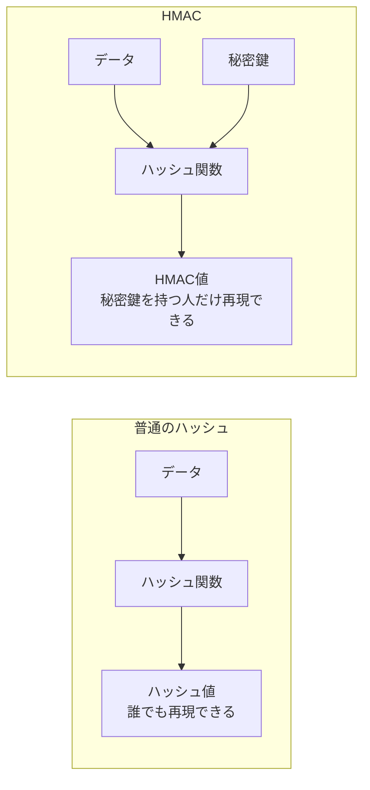

# hash

## 概要
データから固定長の値を生成する一方向関数。改ざん検知（完全性の確認）に使われるが、それ単体では発信元の証明（真正性）にはならない。

## 理解したこと

### 性質

| 性質 | 内容 |
|--|--|
| 決定性 | 同じデータからは常に同じハッシュ値が生成される |
| アルゴリズム依存性 | 同じデータでもアルゴリズムが違えば別の値になる |
| 一方向性 | ハッシュ値から元のデータを逆算できない（理論上は総当たりで可能だが、現実的な時間では不可能） |
| 衝突耐性 | 異なるデータから同じハッシュ値が生成されることを、意図的に起こすのが計算量的に困難 |

出力が固定長で入力は無限にある以上、衝突（異なるデータが同じハッシュ値になること）自体は理論上必ず存在する。「絶対に起きない」のではなく「意図的に起こすのが極めて困難」というのが正確な性質。

---

### 衝突（コリジョン）と2つの攻撃パターン

| | 第2原像攻撃 | 衝突攻撃 |
|--|--|--|
| 状況 | 既存のファイルAが決まっていて、同じハッシュ値になる偽物Bを後から作る | A・Bどちらも攻撃者が自由に選べる状態で、同じハッシュ値になるペアを探す |
| 難易度 | 高い（特定の相手を狙う必要がある） | 誕生日のパラドックスにより相対的に見つけやすい |
| 実例 | — | SHA-1の衝突実証など、実際の攻撃はこちらのパターンが多い |

①（特定ファイルへのなりすまし）の方が「安全性を掻い潜る」という意図は明確だが、②（自由なペア探し）の方が確率的に先に成立しやすいというねじれがある。

---

### ハッシュ単体の限界

ハッシュ関数は鍵を使わず誰でも計算できるアルゴリズムのため、データを改ざんした攻撃者も改ざん後のデータに対してハッシュ値を計算し直せる。

受信側は「ハッシュ値が一致する」ことしか確認できず、それが正規の送信者によるものか区別がつかない。

完全性（改ざん検知）と真正性（本人証明）の違い、デジタル署名との組み合わせ方は [information_security_properties.md](information_security_properties.md) を参照。

---

### 鍵を混ぜて限定性を作る: HMAC

普通のハッシュは「データ」だけを入力にするため、誰でも同じ値を再現できてしまう(上記の限界)。HMACは入力に「秘密鍵」を混ぜることで、その値を秘密鍵を持つ人限定にする。

「決定性」(同じ入力なら常に同じ出力になる)という性質はそのまま利用しつつ、入力に秘密鍵を混ぜることで「誰でも計算できる」を「秘密鍵を持つ人限定」に変える。これによって、ハッシュ単体では持てなかった真正性(本人証明)を獲得する。

具体的な利用例は [totp.md](totp.md) を参照(秘密鍵+時刻カウンタをHMAC-SHA1にかけて6桁コードを作る)。

---

### 改ざん検知に使う際の注意点

比較用の正しいハッシュ値は、確認したいデータ自体とは別の、信頼できる経路（公式サイトなど）で入手する必要がある。

同じ経路でハッシュ値もデータも配布されていると、攻撃者が両方まとめて差し替えられてしまい、比較が意味を成さなくなる。

## 関連概念
- [digital_signature.md](digital_signature.md)（ハッシュ〈完全性〉に秘密鍵での署名を組み合わせることで真正性を担保する仕組み）
- [information_security_properties.md](information_security_properties.md)（完全性と真正性の違い、署名の内部処理の詳細）
- [totp.md](totp.md)（HMACの具体的な利用例。秘密鍵+時刻カウンタで6桁コードを生成する）

## 関連実装
- [hash_and_signature_basics](../coding/hash_and_signature_basics/) — ハッシュの決定論性・雪崩効果を実装して確認

## ソース
- 書籍：イラスト図解式 セキュリティの基本 第2章（2026-08-20）

## タグ
ハッシュ, 完全性, 衝突, 衝突耐性, 一方向性, デジタル署名, セキュリティ
