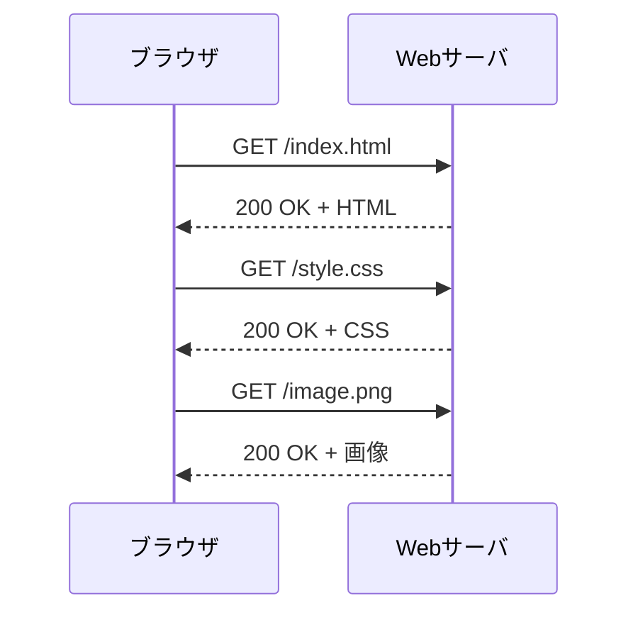

# HTTP（HyperText Transfer Protocol）

## 概要
WebブラウザとWebサーバーの間でWeb情報をやり取りするためのプロトコル。

## 理解したこと

### なぜ必要か

ブラウザとサーバーが共通のルールで通信するために必要。HTTPがなければどのソフトがどう送ってきても解釈できない。

---

### リクエスト/レスポンスの流れ

1つのリクエストに1つのレスポンスを返すシンプルな仕組み。ページ表示時はまずHTMLを受け取り、その中で必要な画像・CSSなどを順次リクエストし直す。

---

### リクエストの構成

| 要素 | 内容 |
|------|------|
| リクエスト行 | メソッド（何をしたいか）＋対象ファイル名 |
| ヘッダフィールド | リクエストの細かい条件・送信元のプロフィール情報 |
| 空行 | |
| メッセージ本体 | 送信データ（POSTや画像アップロード時など、必要なときだけ使う） |

---

### 主なHTTPメソッド

| メソッド | 意味 |
|----------|------|
| GET | リソースの取得 |
| HEAD | ヘッダのみ取得（本体なし） |
| POST | データの送信・リソースの作成 |
| PUT | リソースの更新・作成 |
| DELETE | リソースの削除 |

---

### GET / POST の使い分け

URLに再現性が必要かどうかが判断基準。

| メソッド | 特徴 | 使われる場面 |
|---------|------|-------------|
| GET | URLに情報が付く（再現性あり） | 通常のリンク（`<a>`タグ）、URLをコピペで再現したい画面 |
| POST | URLに情報が付かない（ペイロードに入る） | `<form>` タグ経由のデータ送信、ログイン・入力フォーム |

- `<a>` タグは必ずGET。POSTに切り替えられるのは原則 `<form>` タグ経由のみ。
- POSTはURLに出ないだけで、リクエストのペイロード（本体）に情報が入る。開発者ツールで見れるため「完全に隠れる」わけではない。
- 機密情報（パスワード等）はPOSTだけでなくHTTPSも必要。POST = URLに出さない / HTTPS = 通信を暗号化 は別の役割。

---

### レスポンスの構成

| 要素 | 内容 |
|------|------|
| ステータス行 | ステータスコード（処理結果） |
| ヘッダフィールド | レスポンスの付加情報 |
| 空行 | |
| メッセージ本体 | リクエストしたファイルの中身（HTML・画像など） |

---

### ステータスコード

| 分類 | 意味 | 責任 |
|------|------|------|
| 1xx | 処理中 | - |
| 2xx | 成功 | - |
| 3xx | リダイレクト（転送先を案内） | - |
| 4xx | クライアントエラー | リクエスト側 |
| 5xx | サーバーエラー | サーバー側 |

よく使うもの：200（正常）、401（認証が必要）、404（見つからない）、408（タイムアウト）、500（サーバー内部エラー）

---

## 関連概念
- static_dynamic_content（HTTPで配信される静的・動的コンテンツの種別を定義する）
- url（HTTPリクエストの送信先を特定するための識別子）
- application_layer_protocols（HTTPが属するアプリケーション層のプロトコル群）
- transport_layer（HTTPの下位に位置し、通信の信頼性を担保する）
- https（HTTPにTLSによる暗号化を加えたセキュアな拡張）

## ソース
- 2026-05-01：イラスト図解式ネットワークの基本 第5章

## タグ
HTTP, プロトコル, リクエスト, レスポンス, ステータスコード, メソッド, Web
