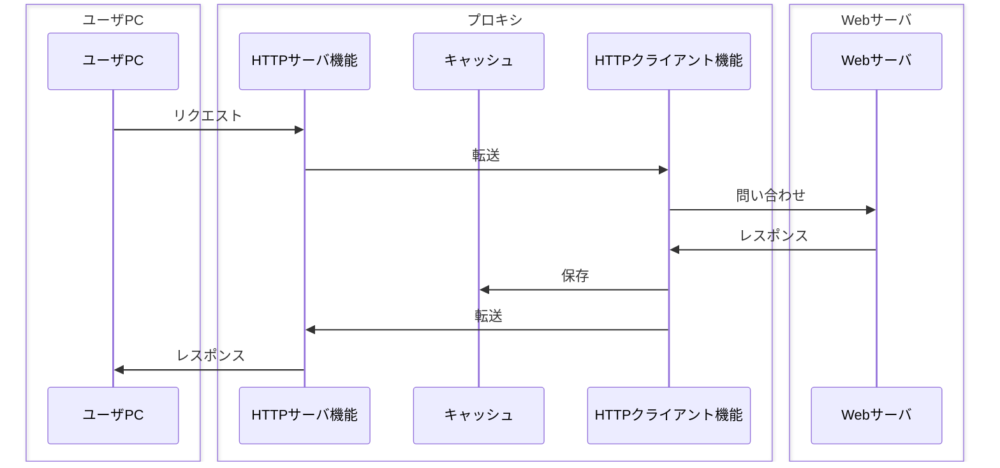
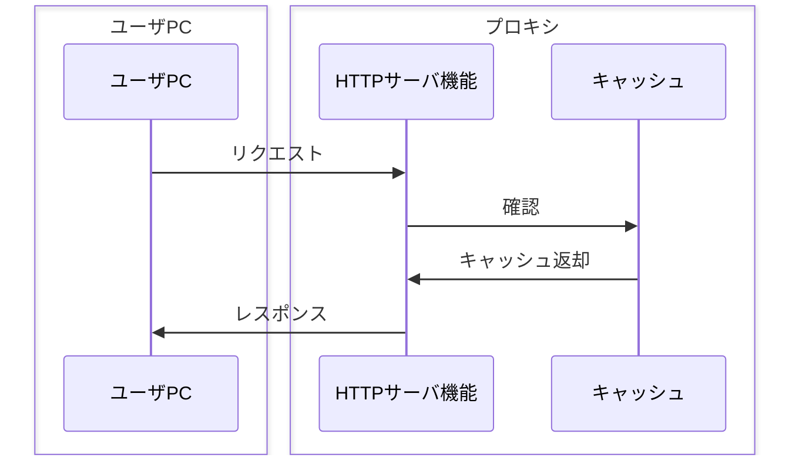

# HTTPプロキシ

## 概要
PCとWebサーバーの間に入り、HTTPの通信を代わりに取り次ぐソフトウェア（およびそれを搭載するデバイス）。

## 理解したこと

### プロキシとは
- PCなどからWebサーバーに直接アクセスさせるのではなく、間に入って通信を取り次ぐコンピュータ
- HTTPを取り次ぐものを特に「HTTPプロキシ」と呼ぶ

### 動作の仕組み

キャッシュがある場合（2回目以降）：

HTTPプロキシの内部には2つの機能がある：

| 機能 | 役割 |
|------|------|
| HTTPサーバ機能 | ユーザのPCとやり取り（ユーザ側から見るとサーバとして振る舞う） |
| HTTPクライアント機能 | Webサーバに問い合わせ（Webサーバ側から見るとクライアントとして振る舞う） |

- Webサーバからのレスポンスは**キャッシュ**に保存される
- 同じリクエストが来たときはキャッシュから返す（キャッシュには有効期限あり。期限切れ後は再問い合わせ）

### 3つの機能（メリット）
1. **コンテンツのキャッシュ** — 一度取得したコンテンツを使い回すことで通信を効率化
2. **ウイルス検出・不正侵入防止** — Webサーバ→プロキシ方向の通信を監視・フィルタリング
3. **有害サイトの遮断** — プロキシ→ユーザPC方向の通信を制御し、危険なサイトへのアクセスをブロック

2・3はいずれも「ユーザを守る防波堤」としての役割。

## 関連概念
- http.md
- https.md

## ソース
- 2026-05-12：イラスト図解式ネットワークの基本 第5章

## タグ
HTTPプロキシ, プロキシ, キャッシュ, セキュリティ, ネットワーク, フィルタリング
