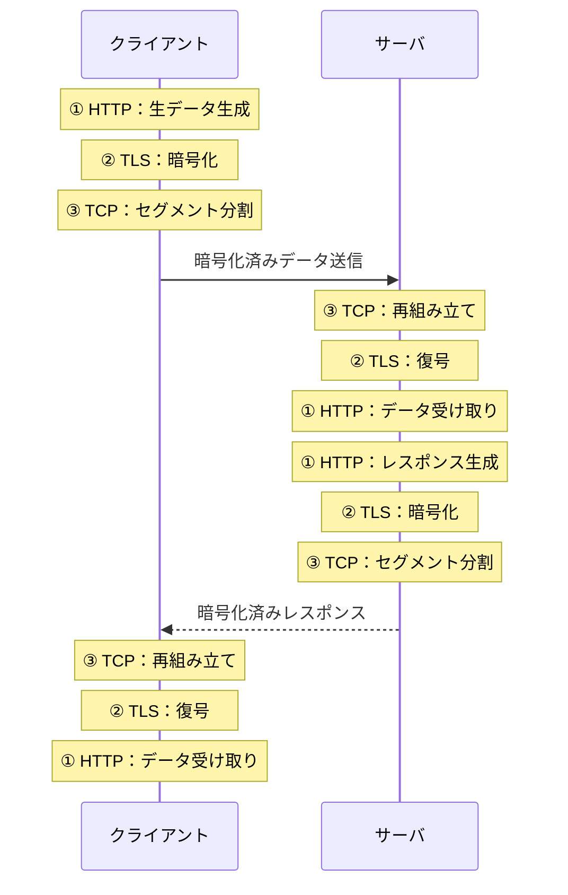

# HTTPS（HyperText Transfer Protocol Secure）

## 概要
HTTP通信をSSL/TLSによって安全化したプロトコル。「HTTP + TLS」と表現できる。ポート番号：443番。

## なぜ必要か
HTTPは平文通信のため盗聴・改ざんのリスクがある。TLSを挟むことでHTTPの仕組みを変えずに安全性を追加できる点が革新的。

## データの流れ

各層は隣のレイヤーとやり取りしているつもりのまま動くため、HTTPもTCPも改造不要。

実質的にはTLSが使われている（SSLは現在非推奨）。

## 関連概念
- ssl_tls.md
- http.md
- encapsulation.md
- transport_layer.md
- tcp_ip_model.md

## ソース
- 2026-05-04：イラスト図解式ネットワークの基本 第5章

## タグ
HTTPS, HTTP, TLS, SSL, セキュリティ, 暗号化, ポート443, Web
