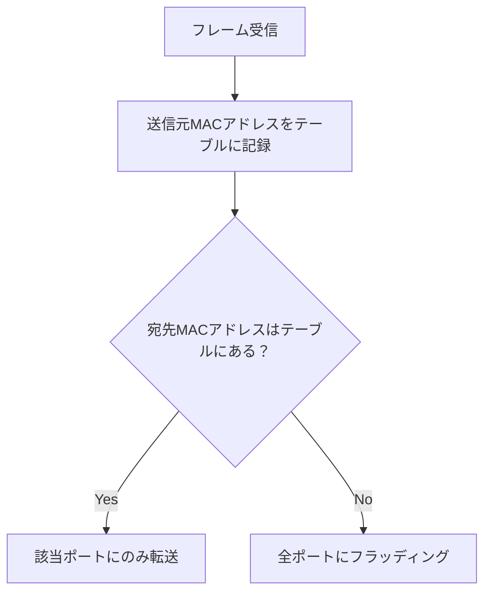

# ハブ/スイッチ（Hub / Switch）

## 概要
OSI参照モデルの物理層・データリンク層で動く、イーサネットを相互接続するための機器。

## なぜ必要か
複数のPCをネットワークで繋ぐには、フレームを中継する機器が必要。ハブ/スイッチがその役割を担い、複数のイーサネットを1つのネットワークとして機能させる。

## ハブ vs スイッチ

ハブとスイッチは元々同じもので、正確には両者まとめて「スイッチングハブ」と呼ぶ。機能の違いで呼び分けるのが昨今の慣例。

| | ハブ | スイッチ |
|---|---|---|
| OSI層 | L1（物理層） | L2（データリンク層） |
| 転送方式 | 全ポートにブロードキャスト | 宛先MACアドレスのポートのみ |
| MACアドレステーブル | なし | あり（動的学習） |
| 管理機能・VLAN | なし | あり |

## MACアドレステーブルの学習フロー

スイッチはテーブルを静的に登録するのではなく、届いたフレームの送信元MACアドレスを記録することで動的に学習する。

→ フラッディングの詳細は flooding.md

## カスケード接続

ハブ同士を複数段にわたって接続すること。段数が増えるほど遅延が積み重なり、帯域の共有による渋滞が起きやすくなるため、実際は3〜4段が目安。

## 関連概念
- osi_model.md
- network_interface_layer.md
- lan_wan.md
- mac_address.md

## ソース
- 2026-04-08・書籍「イラスト図解式ネットワークの基本」第2章
- 2026-04-10・書籍「イラスト図解式ネットワークの基本」第3章
- 2026-04-24・書籍「イラスト図解式ネットワークの基本」第4章

## タグ
ネットワーク, イーサネット, ハブ, スイッチ, OSI, データリンク層, 物理層
