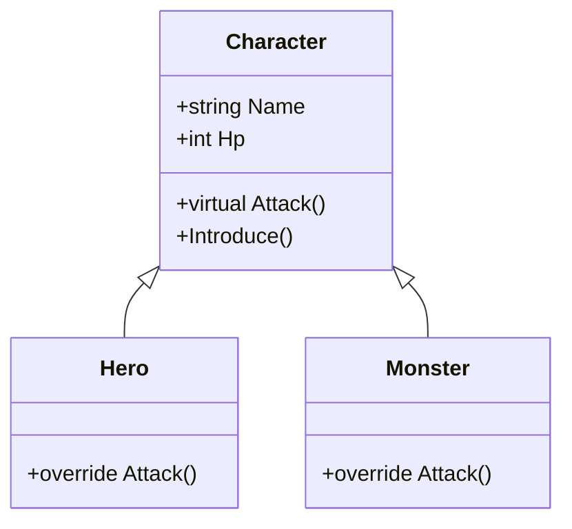
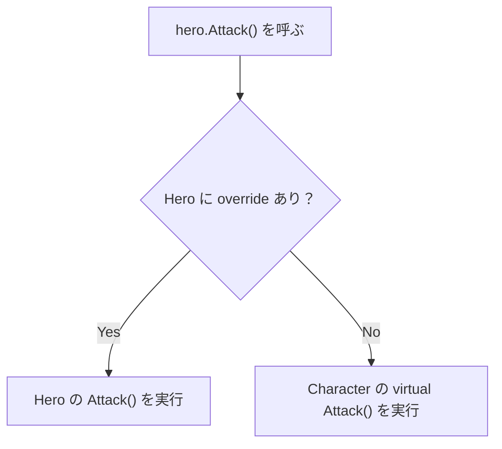
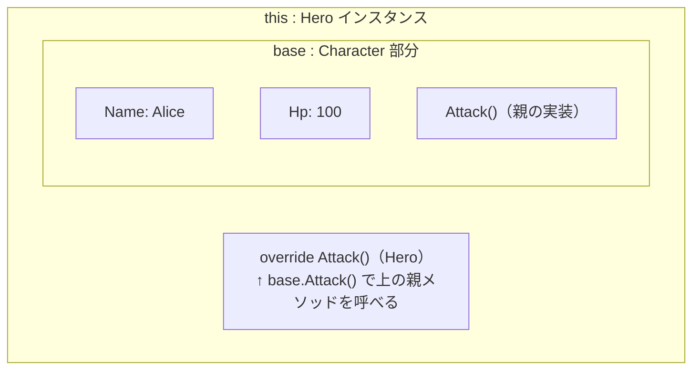
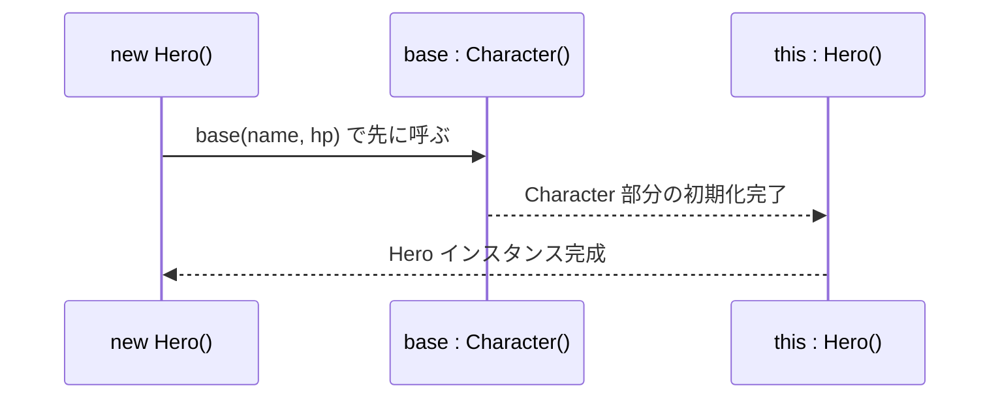
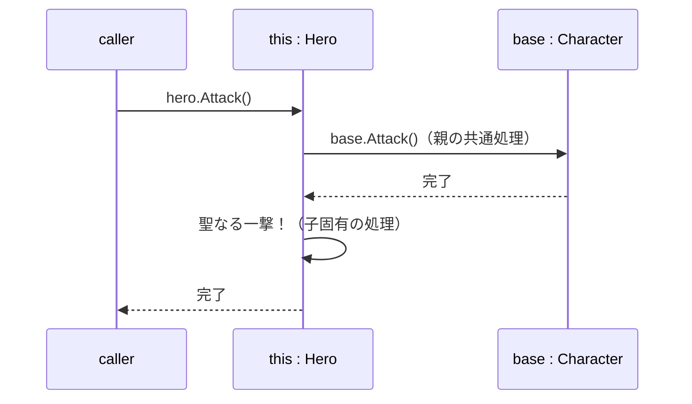

# 継承（Inheritance）

## 概要
「AはBの一種（Is-a関係）」を表す仕組み。親クラスのプロパティ・メソッドをサブクラスが引き継ぐ。C# は単一継承のみ（親クラスは1つ）。

## 継承ツリー



## クラスの種類

| | 通常クラス | 抽象クラス | インターフェース |
|---|---|---|---|
| インスタンス化 | 可 | 不可 | 不可 |
| 実装の有無 | あり | 混在可 | なし（署名のみ） |
| 親の数 | 1つ | 1つ | 複数可 |
| 関係性 | Is-a | Is-a | Can-do |

## virtual vs abstract

| | virtual | abstract |
|---|---|---|
| 中身 | あり | なし |
| override | 任意 | 強制 |
| インスタンス化 | 可 | 不可 |

## メソッド呼び出しの流れ（virtual / override）



## base キーワード

親のコンストラクタを子クラスから呼ぶ仕組み。共通の初期化処理を親に一箇所まとめられる。

```csharp
abstract class Character {
    public string Name { get; private set; }
    public int Hp { get; private set; }

    public Character(string name, int hp) {
        Name = name;
        Hp = hp;
    }
}

class Hero : Character {
    public Hero(string name, int hp) : base(name, hp) { }  // 親のコンストラクタに委譲
}
```

## インスタンスのイメージ

継承したインスタンスは「親を先に生成し、子で包む」構造になっている。
サブクラス視点では、自分全体が `this`、内包する親が `base`。



## コンストラクタの実行順

`new Hero()` を呼んだとき、`base`（親）から順に初期化が走る。



## base.メソッド名() による親処理の活用

`override` の中で `base.Attack()` を呼ぶと、親の実装を活かしつつ子固有の処理を追加できる。



## 継承の問題点

**① いらないものがついてくる**
親クラスのメソッドはすべて子に引き継がれる。必要なものだけ選ぶことはできない。

```csharp
class Turret : Character {
    // Attack() が欲しいだけなのに
    // Move(), Eat(), Sleep() もついてくる — 消せない
}
```

**② 親の変更が子を壊す（密結合）**
子のコードを一行も変えていないのに、親を変えるだけで子の挙動が変わる。

```csharp
class Character {
    public virtual void Attack() {
        Move();       // ← 後から追加
        DealDamage();
    }
}
// Turret は変更なし → でも Attack() を呼ぶと Move() が走る → 想定外の挙動
```

これらが問題になる場合は → [composition.md](composition.md)

## 関連概念
- oop_interface
- polymorphism
- oop_encapsulation
- composition

## ソース
- 2026-05-17：会話ベースの整理（C# .NET を題材に）

## タグ
継承, OOP, C#, abstract, virtual, override, base, Is-a, this
