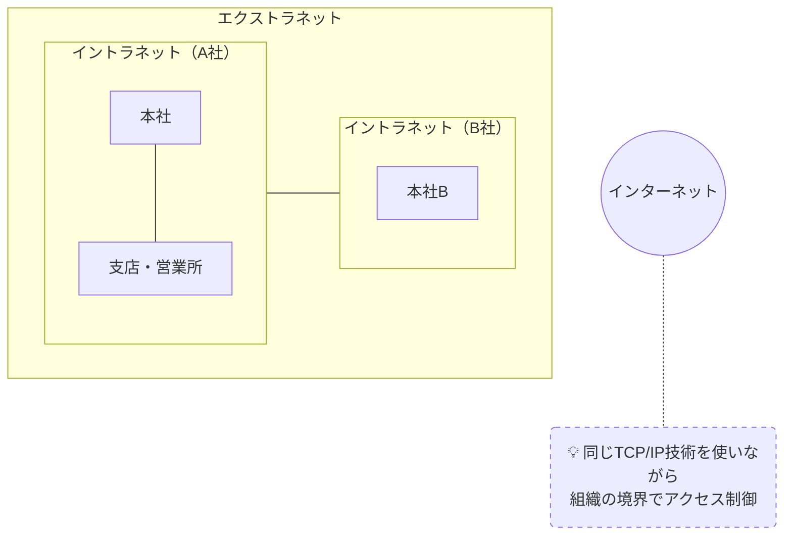

# イントラネット・エクストラネット

## 概要
インターネット技術（TCP/IP・HTTP等）を活用して構築する組織内・組織間ネットワーク。

## 理解したこと
- **イントラネット**：インターネットの技術スタックを組織内だけで閉じて使うネットワーク。本社・支店・営業所など同一組織の拠点を統合する
- **エクストラネット**：異なる組織のイントラネット同士を接続したネットワーク。B2Bの電子商取引などで活用される
- どちらも「インターネットと同じ仕組みを使って構築する」点が共通

| | 範囲 | 用途例 |
|---|---|---|
| イントラネット | 組織内 | 社内システム・メール |
| エクストラネット | 組織間（A社↔B社） | 電子商取引・B2B連携 |

## 構成図

<!-- イラスト図解式ネットワークの基本 1章 / 2026-03-30 -->

## 関連概念
- lan_wan.md
- vpn.md

## ソース
- 2026-03-28・「イラスト図解式 ネットワークの基本」第1章

## タグ
ネットワーク, イントラネット, エクストラネット, インフラ
