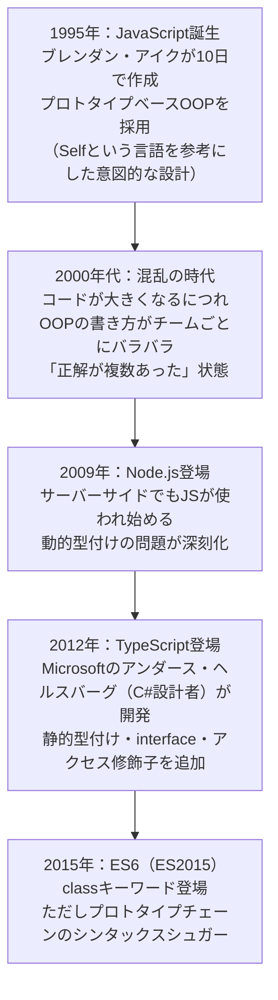

# JavaScript言語設計の歴史

## 概要
1995年の誕生からTypeScriptまで、JavaScriptがOOP対応をどう変遷させてきたかの歴史。

## 理解したこと

### 変遷の流れ



### 「混乱の時代」の本質

「間違い」が横行していたのではなく、**正解が複数あった**のが問題。
言語仕様として正しい書き方の強制がなかったため、全員が異なるアプローチで同じことを実現していた。

### ES6 classはシンタックスシュガー

見た目はC#と同じだが、裏ではプロトタイプチェーンが動いている。言語の根本は変わっていない。

```js
// ES6以降
class Hero extends Character { ... }
// 裏ではprototypeを繋いでいるだけ
```

### TypeScriptの位置づけ

```
TypeScript（書くとき：静的・ルールあり）
  ↓ コンパイルすると
JavaScript（動かすとき：動的・JSの世界）
```

TypeScriptが追加した `private`・`interface`・型注釈はコンパイル時にのみ存在し、実行時には消えてただのJSになる。「JSの良さはそのままに、書くときのルールだけ追加」した設計。

### 「10日で作られた」の正確な理解

| | 内容 |
|---|---|
| 本当の粗さ | `typeof null === "object"` など実装上のバグ |
| 意図的な設計 | プロトタイプベース・動的型付け（Selfから影響を受けた選択） |
| 統一感のなさの原因 | 自由度の高さゆえ「正しい書き方」が言語仕様で決まらなかった |

## 関連概念
- prototype_oop
- oop_interface
- solid_principles
- javascript_ecosystem_history

## ソース
- 2026-05-30：会話ベースの整理

## タグ
JavaScript, TypeScript, 歴史, プロトタイプ, ES6, 動的型付け, 静的型付け
