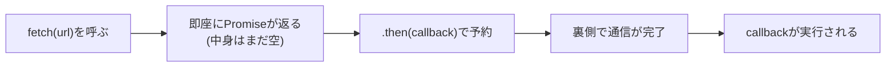
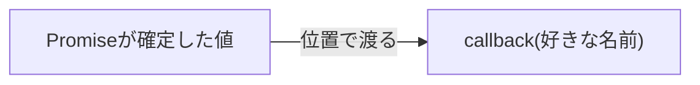
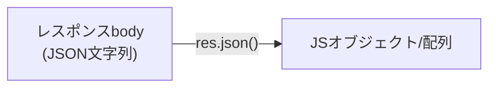
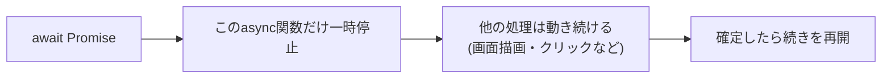

# JavaScript Promise・async/await

## 概要
Promiseは非同期処理の結果を表す入れ物。`.then()`で確定後の処理を予約でき、`async`/`await`はそれを同期的なコードのように書く糖衣構文。

## 理解したこと

### Promiseは結果を表す「箱」、`.then()`はその箱への予約
非同期処理（`fetch`など）は呼び出した瞬間には終わっていない。それでも即座に返るのは「まだ空だが後で結果が入る箱」＝Promise。`.then(callback)`はその箱に対する「確定したら実行して」という予約であり、`.then()`自体は非同期処理をしていない。



---

### コールバック引数の名前は位置渡しなので自由



`.then((data) => {...})`の`data`は決められた名前ではなく、`useState`の分割代入と同じ「位置渡しなら名前は自由」という原則。

---

### `res.json()`はJSON文字列をJSオブジェクトにパースする



`.then()`のコールバックに渡ってくるのは、パース後のJSオブジェクト。

---

### async/awaitは`.then()`チェーンの糖衣構文



```js
// .then()チェーン
fetch(url).then((res) => res.json()).then((data) => { ... });

// async/await（同じ処理）
const res = await fetch(url);
const data = await res.json();
```

## 関連概念
- react_use_state（コールバック引数・分割代入の名前が自由な理由は「位置渡し」という共通の原則）

## 関連実装
- [react_dotnet_api](../coding/react_dotnet_api/) — fetchでのGET/POST・async/awaitと.then()両方の書き方を実装した

## ソース
- 2026-08-15・/codeセッション（react_dotnet_api）の対話から整理

## タグ
JavaScript, Promise, async, await, 非同期処理, コールバック
