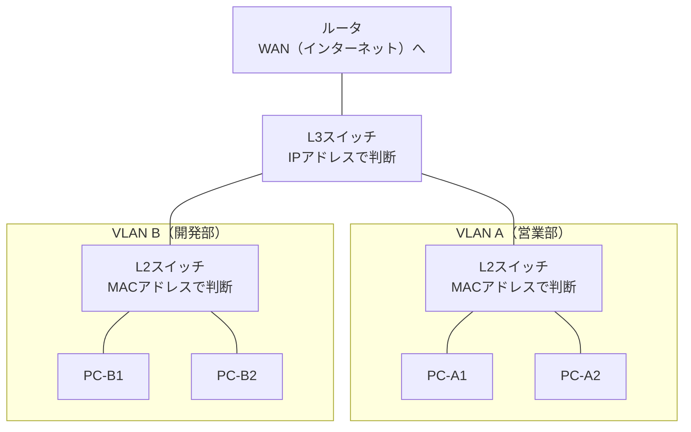

# L3スイッチ

## 概要
ルータ機能を内蔵したスイッチ。LAN内のVLAN同士をIPアドレスで接続する機器。

## 理解したこと
- 生まれた背景：社内ネットワークでVLAN同士をつなぐために、スイッチにルータ機能を詰め込んだ
- **L2スイッチとの違い**：L2はMACアドレスで転送先を判断、L3はIPアドレスで判断
  - L2スイッチ：1つのVLAN（部署）内の機器をつなぐ
  - L3スイッチ：VLAN同士（部署間）をつなぐ
  - 物理的に別の機器として存在する

- **ルータとの違い**：
  - 主戦場：L3スイッチはLAN内、ルータはWAN（インターネット接続）
  - 処理速度：L3スイッチはルータより高速
    - ハードウェア処理（ルータはソフトウェア処理）
    - やることが定型化されている（LAN内転送に特化）
  - ルータとL3スイッチは役割分担して両方使う（ルータだけでは処理が重すぎる）

## 関連概念
- hub_and_switch.md
- vlan.md
- router.md
- ip_address.md
- mac_address.md

## ソース
- 2026-04-27：書籍「イラスト図解式ネットワークの基本」第4章
- 2026-04-27：https://eonet.jp/column/optical-line/layer3-switch.html

## タグ
L3スイッチ, ネットワーク, VLAN, LAN, ルータ, IPアドレス, ハードウェア処理
